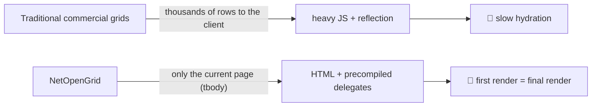
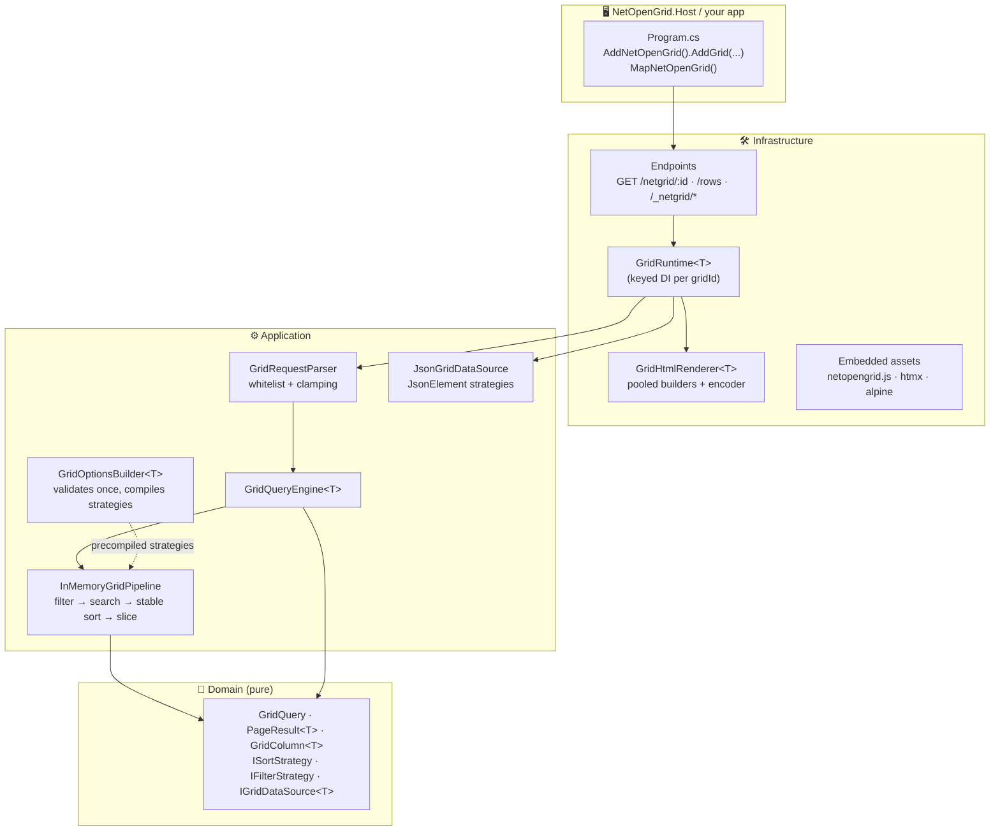
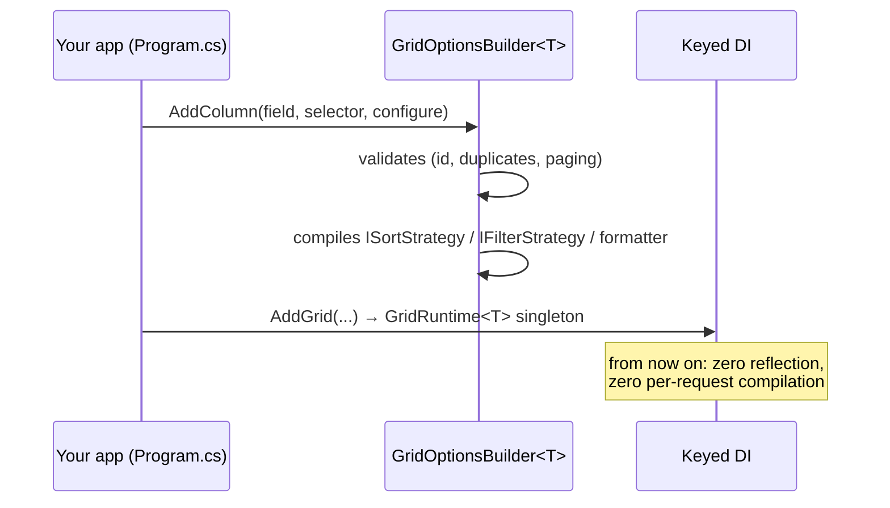
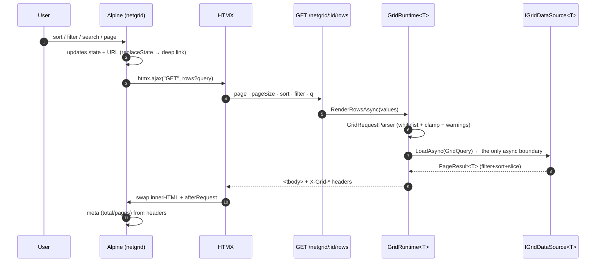
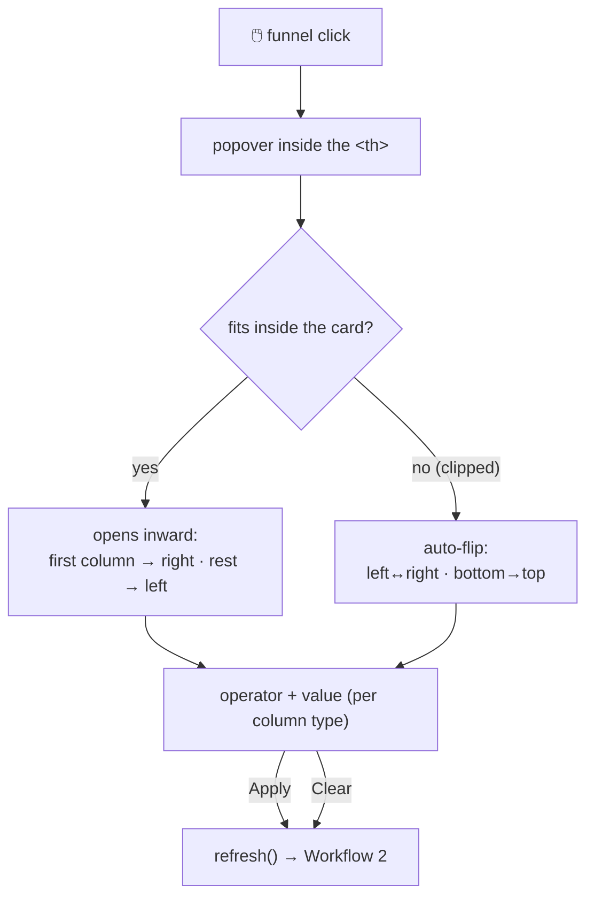
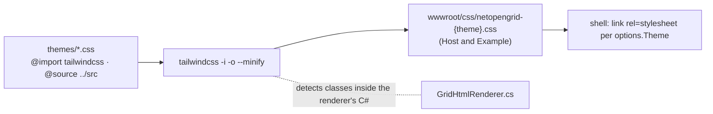
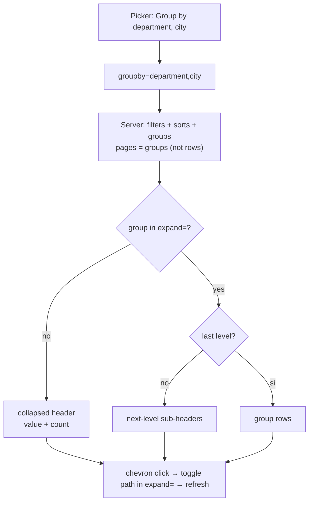

<div align="center">

[](README.md)
[](README.en.md)

# ⚡ NetOpenGrid

**The .NET 10 grid built on a different architecture: server-rendered HTML + precompiled delegates.**

No virtual DOM. No reflection on the hot path. No per-request expression compilation.

[](https://dotnet.microsoft.com)
[](https://learn.microsoft.com/dotnet/csharp/)
[](https://tailwindcss.com)
[](https://htmx.org)
[](https://alpinejs.dev)
[](#-testing)
[](LICENSE)
[](https://www.nuget.org/packages/NetOpenGrid)
[](https://github.com/mchinchilla/NetOpenGrid/actions/workflows/publish.yml)

</div>


---

## 📖 Table of contents

- [Why it exists](#-why-it-exists)
- [✨ Features](#-features)
- [Stack](#-stack)
- [Architecture](#-architecture)
- [Installation](#-installation)
- [Quickstart](#-quickstart)
- [Razor view (embedded grid)](#-razor-view-embedded-grid)
- [Workflows](#-workflows)
- [EF Core (SQL push-down)](#-ef-core-sql-push-down)
- [Excel-style filters (per-value counts)](#-excel-style-filters-per-value-counts)
- [Pinned & reorderable columns](#-pinned--reorderable-columns)
- [Server-side CSV export](#-server-side-csv-export)
- [i18n](#-i18n)
- [Column grouping (nested)](#-column-grouping-nested)
- [Configuration reference](#-configuration-reference)
- [Column types & operators](#-column-types--operators)
- [Client ↔ server contract](#-client--server-contract)
- [JSON mode](#-json-mode)
- [Themes (Tailwind v4)](#-themes-tailwind-v4)
- [Performance](#-performance)
- [Project layout](#-project-layout)
- [Testing](#-testing)
- [Roadmap](#-roadmap)
- [License](#-license)

---

## 🧭 Why it exists

Traditional commercial grid suites ship thousands of rows to the client and pay for it with massive
JS bundles and reflection. **NetOpenGrid flips the model**: the server renders only the current page's
`<tbody>`, and all the intelligence (filter, sort, search, paging) runs on
**delegates compiled exactly once** when the grid is configured.



> **Golden rule of the project:** zero reflection and zero `Expression.Compile` per request.
> Everything is compiled while building the options; the hot path only invokes delegates.

---

---

## ✨ Features

| Category | Feature | Detail |
|---|---|---|
| 📊 **Data** | Pluggable sources | `InMemoryGridDataSource<T>` · `JsonGridDataSource` (`JsonElement`) · `EFCoreGridDataSource<T>` (SQL push-down) |
| | Typed, reflection-free | Delegate or expression selectors; sort/filter/search strategies compiled once at startup |
| 🔍 **Filters** | By operator | 11 operators with per-column-type whitelist (text/num/date/enum/bool) |
| | Excel-style | Distinct-value checklist **with counts** (Excel context: ignores the column's own filter) |
| | Global search | `q` with debounce, OR across `Searchable` columns |
| ↕️ **Sorting** | Stable multi-sort | Shift-click, deterministic ties (decorated array), nulls first |
| 🗂️ **Grouping** | Nested up to 3 levels | `groupby` + `expand` in the URL; chevron headers with counts; groups are paged |
| 📄 **Paging** | Server-side | `pageSize` clamping, meta via headers, full deep-linking |
| ☑️ **Selection** | Rows + export | Floating bar, select-all, CSV of selection or the full filtered dataset |
| 📌 **Columns** | Pin + reorder | Sticky with JS-computed offsets, drag & drop persisted in `localStorage` |
| 🌐 **i18n** | EN/ES presets | ~39 keys, per-key overrides, `__NETGRID__.locale` blob for the client |
| 🎨 **Theming** | Tailwind v4 | `grid`/`midnight` presets, persisted dark mode, class scanning inside C# |
| 🔌 **Self-contained** | Embedded assets | JS + HTMX + Alpine inside the assembly, served with immutable `?v={sha}` |
| 🔗 **Deep links** | State in URL | `page·pageSize·sort·filter·q·groupby·expand·cols` — share the exact view |
| ♿ **A11y** | Localized aria-labels | Roles, `aria-expanded`, focus rings, `x-cloak` |

## 🧱 Stack

| Layer | Technology | Role |
|---|---|---|
| 🔩 Runtime | **.NET 10 / C# 14** (`net10.0`) | records, collection expressions, keyed DI, `ValueTask` |
| 🖥️ Server | **ASP.NET Core** Minimal APIs | shell + fragment + embedded-asset endpoints |
| ⚡ Reactivity | **HTMX 2** | `htmx.ajax` swaps only the `<tbody>` |
| 🪶 Local state | **Alpine.js 3** | paging, filters, selection, theme — no framework |
| 🎨 Styling | **Tailwind CSS v4** (standalone CLI) | themes compiled to `wwwroot/css`, dark mode |
| 🗄️ Database | **EF Core 10** (optional) | filter/sort push-down to SQL |
| ✅ Testing | **xUnit** + `WebApplicationFactory` | unit + real HTTP integration tests |

---

## 🏛️ Architecture

Dependencies point inward (DDD). The client never sees the Domain.



---

## 📦 Installation

Packages are published to [NuGet](https://www.nuget.org/packages?q=NetOpenGrid). Every commit to `main`
publishes a new version and creates the matching `vX.Y.Z` tag (see [`.github/workflows/publish.yml`](.github/workflows/publish.yml)).

| Package | What it is for |
|---|---|
| [`NetOpenGrid`](https://www.nuget.org/packages/NetOpenGrid) | **The one you install in your ASP.NET Core app.** Meta-package with no assembly of its own: it just references `Infrastructure`, `Application` and `Domain`. |
| [`NetOpenGrid.Infrastructure`](https://www.nuget.org/packages/NetOpenGrid.Infrastructure) | `AddNetOpenGrid()`, `MapNetOpenGrid()`, HTML renderer, embedded assets, CSV export, i18n. Pulls in `Application` and `Domain`. |
| [`NetOpenGrid.Persistence.EFCore`](https://www.nuget.org/packages/NetOpenGrid.Persistence.EFCore) | Data source over an EF Core `IQueryable`: filters, sorting, paging and value counts run in SQL. |
| [`NetOpenGrid.Application`](https://www.nuget.org/packages/NetOpenGrid.Application) | Builders, in-memory query engine, filter strategies and JSON mode. No ASP.NET Core dependency. |
| [`NetOpenGrid.Domain`](https://www.nuget.org/packages/NetOpenGrid.Domain) | Contracts and descriptors (columns, filters, sorting, paging, groups). Dependency-free. |

```bash
dotnet add package NetOpenGrid
# Optional, when your data source is EF Core:
dotnet add package NetOpenGrid.Persistence.EFCore
```

> Versioning: `MAJOR.MINOR` is controlled by `<VersionPrefix>` in [`Directory.Build.props`](Directory.Build.props);
> the workflow bumps `PATCH` automatically on every commit. Raise `MAJOR` or `MINOR` there on API changes.

---

## 🚀 Quickstart

> Reference project: [`samples/NetOpenGrid.Example`](samples/NetOpenGrid.Example)

**1. Register the grid** (options are validated and compiled **once**, at startup):

```csharp
using NetOpenGrid.Infrastructure;

builder.Services.AddNetOpenGrid(o =>        // optional: asset/css routes
{
    o.AssetPrefix = "/_netgrid";            // js + htmx + alpine served by the component
    o.CssPath = "/css";                     // where YOUR compiled theme css lives
})
.AddGrid<Employee>("employees",
    options => options
        .WithTitle("Employees")
        .WithTheme("grid")
        .WithDefaultPageSize(10)
        .EnableRowSelection(e => e.Id.ToString("D"))
        .AddColumn("fullName", e => e.FullName, c => c.Header("Full name").Searchable())
        .AddColumn("salary", e => e.Salary, c => c
            .Header("Salary")
            .Align(ColumnAlign.End)
            .Format(v => v.ToString("C0", CultureInfo.GetCultureInfo("en-US"))))
        .AddColumn("hiredOn", e => e.HiredOn, c => c.Format(d => d.ToString("yyyy-MM-dd"))),
    (_, opts) => new InMemoryGridDataSource<Employee>(opts, EmployeeData.All));
```

**2. Map the endpoints** (shell + fragment + component assets):

```csharp
app.UseStaticFiles();     // only for your theme css
app.MapNetOpenGrid();     // GET /netgrid/:id · /rows · /_netgrid/*
```

**3. Open `http://localhost:PORT/netgrid/employees`.** That's it: the component serves its own
JS (Alpine + HTMX embedded in the assembly) — nothing to copy into `wwwroot`.

---

## 🧩 Razor view (embedded grid)

Each grid is served as its own HTML document at `/netgrid/{id}`. To place it inside one of **your**
Razor views, point an `<iframe>` at it with `?embed=1`: the grid drops its standalone chrome (site header,
page background, max-width, padding) and renders transparent, so it blends into your layout.

| Why an iframe | |
|---|---|
| 🧱 Isolation | The grid's Tailwind theme (with its CSS reset) never touches your site's CSS, and yours never breaks the grid. |
| 🔗 Same origin | Your page can size the frame to its content, so the page scrolls instead of the frame. |
| 🔁 Deep links | Grid state lives in the query string; forward your page's query to the frame and `/products?sort=price:desc` just works. |
| ↗️ Row actions | Links rendered with `target="_top"` navigate the whole page, not the frame. |

Complete, runnable Razor Pages app (`dotnet new web` + these files). Open `http://localhost:PORT/products`.

**1. Packages**

```bash
dotnet add package NetOpenGrid
```

**2. Theme CSS.** The grid loads `{CssPath}/netopengrid-{theme}.css`. Copy the precompiled
`netopengrid-grid.css` (or `netopengrid-midnight.css`) from [`samples/NetOpenGrid.Example/wwwroot/css`](https://github.com/mchinchilla/NetOpenGrid/tree/main/samples/NetOpenGrid.Example/wwwroot/css)
into your `wwwroot/css/`, or compile `themes/*.css` with the Tailwind v4 CLI (see [Themes](#-themes-tailwind-v4)).

**3. `Program.cs`**: register Razor Pages and the grid, map both.

```csharp
using System.Globalization;
using System.Net;
using NetOpenGrid.Application.DataSources;
using NetOpenGrid.Domain.Columns;
using NetOpenGrid.Infrastructure;
using NetOpenGrid.Infrastructure.Endpoints;

var builder = WebApplication.CreateBuilder(args);

builder.Services.AddRazorPages();

var usd = CultureInfo.GetCultureInfo("en-US");

builder.Services.AddNetOpenGrid()
    .AddGrid<Product>("products", grid => grid
        .WithTitle("Product catalog")
        .WithTheme("grid")                          // -> /css/netopengrid-grid.css
        .WithDefaultPageSize(10)
        .WithMinHeight("")                          // the iframe decides the height
        .EnableRowSelection(p => p.Sku)
        .AddColumn(p => p.Sku, c => c.Header("SKU").Pinned())
        .AddColumn(p => p.Name, c => c.Searchable())
        .AddColumn(p => p.Category)
        .AddColumn(p => p.Price, c => c.Align(ColumnAlign.End).Format(v => v.ToString("C2", usd)))
        .AddColumn(p => p.Stock, c => c.Align(ColumnAlign.End))
        .AddColumn(p => p.ReleasedOn, c => c.Format(d => d.ToString("yyyy-MM-dd", CultureInfo.InvariantCulture)))
        .AddColumn("status", p => p.Stock > 0, c => c.Header("Status").RawCellHtml(p => p.Stock > 0
            ? "<span class=\"badge badge-success\">In stock</span>"
            : "<span class=\"badge badge-muted\">Sold out</span>"))
        .AddColumn("open", p => p.Sku, c => c
            .Header("")                             // blank header: a row-action column
            .Sortable(false).Filterable(false).Searchable(false)
            .RawCellHtml(p => $"<a target=\"_top\" href=\"/products/{WebUtility.UrlEncode(p.Sku)}\">Open</a>")),
        (_, options) => new InMemoryGridDataSource<Product>(options, Catalog.Products));

var app = builder.Build();

app.UseStaticFiles();     // wwwroot/css: site.css + netopengrid-grid.css
app.MapNetOpenGrid();     // /netgrid/{id} (+ /rows, /values, /export) and /_netgrid/* assets
app.MapRazorPages();

app.Run();

public enum Category { Electronics, Home, Sports, Toys, Books }

public sealed record Product(string Sku, string Name, Category Category, decimal Price, int Stock, DateOnly ReleasedOn);

public static class Catalog
{
    public static readonly IReadOnlyList<Product> Products = [.. Enumerable.Range(1, 120).Select(i => new Product(
        Sku: $"SKU-{i:D4}",
        Name: $"Product {i}",
        Category: (Category)(i % 5),
        Price: 4.99m + i * 3.25m,
        Stock: i * 7 % 40,
        ReleasedOn: new DateOnly(2024, 1, 1).AddDays(i * 5)))];
}
```

**4. `Pages/_ViewImports.cshtml` and `Pages/_ViewStart.cshtml`**

```cshtml
@addTagHelper *, Microsoft.AspNetCore.Mvc.TagHelpers
```

```cshtml
@{ Layout = "_Layout"; }
```

**5. `Pages/Shared/_Layout.cshtml`**: your layout, plus the small script that fits every grid frame to its content.

```cshtml
<!doctype html>
<html lang="en">
<head>
    <meta charset="utf-8">
    <meta name="viewport" content="width=device-width, initial-scale=1">
    <title>@ViewData["Title"]</title>
    <link rel="stylesheet" href="~/css/site.css" asp-append-version="true">
</head>
<body>
    <main class="container">@RenderBody()</main>

    <script>
        // Grid frames are same-origin: size each one to its content so the page scrolls, not the frame.
        const fitted = new WeakSet();
        const fitGrid = (frame) => {
            const doc = frame.contentDocument;
            if (!doc?.body || doc.URL === "about:blank" || fitted.has(doc)) return;
            fitted.add(doc);
            // Measure <html>, not <body>: the grid's last margin collapses out of <body>.
            const fit = () => { frame.style.height = `${Math.ceil(doc.documentElement.getBoundingClientRect().height)}px`; };
            new ResizeObserver(fit).observe(doc.documentElement);
            fit();
        };
        for (const frame of document.querySelectorAll("iframe[data-netgrid]")) {
            frame.addEventListener("load", () => fitGrid(frame));
            if (frame.contentDocument?.readyState === "complete") fitGrid(frame);
        }
    </script>
</body>
</html>
```

**6. `Pages/Products.cshtml`**: the view that hosts the grid.

```cshtml
@page
@{
    ViewData["Title"] = "Products";

    // ?embed=1 drops the standalone chrome. The grid keeps its state in the query string, so
    // forwarding this page's query makes /products?sort=price:desc&groupby=category a deep link.
    var gridSrc = "/netgrid/products?embed=1"
        + (Request.QueryString.HasValue ? "&" + Request.QueryString.Value![1..] : "");
}

<h1>Products</h1>
<p>Any Razor markup can go around the grid.</p>

<iframe class="grid-frame" data-netgrid src="@gridSrc" title="Product catalog"></iframe>
```

**7. `Pages/Product.cshtml`**: the target of the grid's row-action column.

```cshtml
@page "/products/{sku}"
@{
    var product = Catalog.Products.FirstOrDefault(p => p.Sku == (string?)RouteData.Values["sku"]);
    ViewData["Title"] = product?.Name ?? "Not found";
}

<p><a href="/products">← Products</a></p>
<h1>@(product?.Name ?? "Product not found")</h1>
@if (product is not null)
{
    <p>@product.Sku · @product.Category · @product.Price.ToString("C2", System.Globalization.CultureInfo.GetCultureInfo("en-US"))</p>
}
```

**8. `wwwroot/css/site.css`**

```css
body { margin: 0; font-family: system-ui, sans-serif; }
@media (prefers-color-scheme: dark) { body { background: #0a0a0a; color: #f5f5f5; } }
.container { max-width: 80rem; margin: 0 auto; padding: 0 16px; }

.grid-frame {
  display: block;
  width: 100%;
  height: 640px;          /* first paint; the layout script then fits it to the grid */
  border: 0;
  color-scheme: normal;   /* must match the grid document, or dark pages get an opaque white frame */
}
```

Things to know:

- `color-scheme: normal` on the frame matters. When your page is in dark mode and the frame's color scheme
  differs from the grid document's, browsers paint the iframe opaque white.
- `WithMinHeight("")` turns off the grid's default ≈25-row minimum height, which is meant for standalone pages.
- The row-selection bar posts the selected keys to `POST /netgrid/{id}/export` (form field `ids`). That
  endpoint belongs to your app; the full sample shows one. The toolbar's download button uses the built-in
  `GET /netgrid/{id}/export`.
- In Razor, write `src="@gridSrc"` with the URL built in code. `src="/x?embed=1@query"` is **not** evaluated,
  because Razor reads `1@query` as an e-mail address.

The [full sample](samples/NetOpenGrid.Example) adds an EF Core grid over SQLite (opens grouped by country,
with deep links), a JSON-mode grid with the `midnight` theme, and i18n driven by `appsettings.json`.

---

## 🔄 Workflows

### Workflow 1 — Startup (build time, once)



### Workflow 2 — User interaction (the hot path)



### Workflow 3 — Filter popover (Excel-style)



### Workflow 4 — Themes (Tailwind v4)



### Workflow 5 — Nested grouping



---

## 🗄️ EF Core (SQL push-down)

`EFCoreGridDataSource<T>` composes `Where` / `OrderBy` / `Skip` / `Take` on your `IQueryable<T>`
using **the same columns, operators and parsing rules** as the in-memory grid.

```csharp
builder.Services.AddDbContext<AppDb>(o => o.UseSqlite(cs));

services.AddNetOpenGrid().AddGrid<Employee>("employees",
    options => options
        .AddColumn(e => e.FullName, c => c.Searchable())   // ← use the Expression overloads
        .AddColumn(e => e.Salary)
        .AddColumn(e => e.HiredOn),
    (sp, opts) => new EFCoreGridDataSource<Employee>(
        opts,
        sp,
        scoped => scoped.GetRequiredService<AppDb>().Set<Employee>().AsNoTracking().OrderBy(e => e.Id)));
```

Important rules:

| Rule | Detail |
|---|---|
| 🧾 **Expression columns** | For push-down, define columns with the `AddColumn(e => e.Prop, …)` overloads. If a sortable/filterable/searchable column only has a `Func`, construction fails with an error listing the offending fields. |
| 🔤 **Strings via `LIKE`** | `contains/starts-with/ends-with/equals` translate to `EF.Functions.Like` (case-insensitive under default collations; wildcards escaped). |
| 🔢 **Values parsed once** | The filter literal is parsed with the **same** invariant parser as the in-memory pipeline and embedded as a constant in the tree. |
| 🧵 **Scoped DbContext** | The data source creates an `IServiceScope` per request — a scoped `DbContext` works as-is. |
| ↩️ **Stable ordering** | SQL does not guarantee stable ties: add a sort on a unique column for deterministic paging. |

---

## 📋 Excel-style filters (per-value counts)

Text, enum and boolean columns show a **checklist of distinct values with counts** in the popover:

- Counts respect the current context (search + other filters) and **ignore the column's own filter** — classic Excel semantics.
- In-list search, *Select all* and a truncation notice (`FilterValuesLimit`, default 200).
- Applying generates an `in` filter:

```
filter=category:in:["Books","Toys"]
```

- Values endpoint (used by the popover, handy for your own UI too):

```
GET /netgrid/:id/values?field=category&<context>
→ {"field":"category","totalDistinct":5,"limit":200,"values":[{"value":"Books","count":28},…]}
```

Implemented across all three engines: in-memory (snapshot grouping), JSON (`JsonElement`) and EF Core (`GROUP BY` translated to SQL). Numeric/date columns keep the operator popover.

---

## 📌 Pinned & reorderable columns

```csharp
.AddColumn("sku", p => p.Sku, c => c.Header("SKU").Pinned())
```

- **Pinned**: `position: sticky` on `th`/`td` with offsets computed by JS after every render/resize — the column stays visible during horizontal scroll (the selection column is always pinned).
- **Reorderable**: drag a `th` to reorder. Order persists in `localStorage` per grid and travels to the server as `cols=field1,field2,…`; the renderer validates against the whitelist (unknown fields are ignored, unlisted ones are appended in default order).

---

## 📤 Server-side CSV export

`GET /netgrid/:id/export?<context>` downloads the **full dataset** (all pages) with the current
filter, search, sort and column order (`cols`) — RFC-4180 with comma/quote/newline escaping.

```csharp
// zero config: MapNetOpenGrid() already exposes the route
// GET /netgrid/employees/export?filter=department:equals:Design&sort=id
// → Content-Disposition: attachment; filename=employees.csv
```

- Cell values use the column formatters (`Format`); `RawCellHtml` is ignored for safety.
- The toolbar ships a download button that exports the client's current context.
- Transparent paging: iterates `MaxPageSize` pages until the total is covered.

---

## 🌐 i18n

Every client-facing label (buttons, aria-labels, operators, counters, ranges) flows through
`NetOpenGridLocalizationOptions`: English defaults, a bundled **Spanish** preset, and per-key overrides.

```csharp
builder.Services.AddNetOpenGrid(
    o => { o.AssetPrefix = "/_netgrid"; },
    loc => loc.UseCulture("es")                       // bundled preset
              .Set("filter.apply", "Filtrar"));       // fine-grained override
```

- The shell injects `__NETGRID__.locale` with the effective dictionary: Alpine renders chips,
  counters and ranges with the exact same strings (EN fallbacks embedded in the JS).
- ~39 keys: `search.*`, `pager.*`, `records.*`, `range.*`, `filter.*`, `select.*`, `chips.*`, `ops.*`, `pin.aria`, `theme.aria`, `export.aria`.
- The empty message remains `WithEmptyMessage(...)` (per grid).

---

## 🗂️ Column grouping (nested)


`groupby=field1,field2,…` (up to 3 levels) + `expand=` to open groups. **Groups are paged** (not rows); expanding a group reveals its sub-groups or rows (DevEx style — each level expands separately). State lives in the URL → deep links with groups open.

```
GET /netgrid/:id/rows?groupby=department,city&expand=department=Design|city=Lima
```

- Toolbar picker "Group by..." + removable per-level chips.
- Group headers with chevron, row counts and per-level indentation; null values → a "(Blanks)" bucket.
- Group order follows the grouped column's sort; remaining sorts order rows inside each group.
- Engines: in-memory and JSON group in memory; **EF Core** pushes filter+sort down to SQL and builds the tree over the matching rows.

---

## 📚 Configuration reference

### `GridOptionsBuilder<T>`

| Method | Default | Description |
|---|---|---|
| `.WithId(id)` | — | **Required.** `^[A-Za-z][A-Za-z0-9_-]{0,63}$` |
| `.WithTitle / .WithSubtitle` | `"Data grid"` | Shell header |
| `.WithDefaultPageSize(n)` | `25` | Clamped to `[1, MaxPageSize]` |
| `.WithMaxPageSize(n)` | `500` | Hard server ceiling |
| `.WithPageSizeChoices([...])` | `[10,25,50,100]` | Sorted and deduplicated |
| `.WithDebounce(ms)` | `300` | Global search |
| `.WithTheme(name)` | `"grid"` | Compiles to `netopengrid-{name}.css` |
| `.WithMinHeight(css)` | `"64rem"` | ≈25 rows; prevents collapse while filtering. `""` disables it |
| `.WithEmptyMessage(msg)` | `"No records found."` | Centered empty state |
| `.EnableRowSelection(keyFn)` | off | Floating bar + export; `keyFn` must be stable and unique |
| `.WithNavLinks(...)` | `[]` | Shell navigation |

### `GridColumnBuilder<T, TKey>`

| Method | Default | Description |
|---|---|---|
| `.Header(text)` | humanized name | `birthDate` → "Birth date" |
| `.Selector(Func)` / `.Selector(Expression)` | — | The expression is compiled **once** here (and kept for EF push-down) |
| `.Format(Func<TKey,string?>)` | `DefaultValueFormatter` | Invariant culture, no boxing |
| `.RawCellHtml(Func<T,string?>)` | — | ⚠️ Trusted HTML (badges); everything else is always encoded |
| `.Sortable / .Filterable / .Searchable` | `true/true/auto` | `auto`: search only on text columns |
| `.AllowedOps(FilterOpSet)` | `All` | **Intersected** with what the type supports |
| `.Comparer / .Parser / .SearchMatch` | built-ins | Reflection-free overrides |
| `.Align / .WidthCss / .Visible` | `Start/–/true` | Presentation |
| `.DataType(...)` | inferred | `Text · Numeric · Date · Boolean · Enum · Unknown` |

### Assets (served by the component, embedded in the assembly)

| Option | Default | Description |
|---|---|---|
| `o.AssetPrefix` | `/_netgrid` | Prefix for `netopengrid.js` + `vendor/*` |
| `o.CssPath` | `/css` | Where **your** theme css is served from |
| `o.CssFilePrefix` | `netopengrid-` | Naming: `netopengrid-{theme}.css` |

Caching: `Cache-Control: immutable` + `?v={sha256-12}` — zero copying into `wwwroot`.

---

## 🎛️ Column types & operators

Popover operators are **intersected** while building the options:
`what you ask for ∩ type preset ∩ actual strategy capability`. The UI can never
request an operator the engine cannot execute.

| Type (TKey) | Preset | Operators |
|---|---|---|
| `string` | Text | `equals` · `not-equals` · `contains` · `starts-with` · `ends-with` · `is-empty` · `is-not-empty` |
| numerics, `DateOnly`, `DateTime`, `DateTimeOffset` | Numeric | `equals` · `not-equals` · `gt` · `gte` · `lt` · `lte` |
| `enum` | Equality | `equals` · `not-equals` |
| `bool` | Equality | `equals` · `not-equals` |
| others (classes) | Equality | `equals` · `not-equals` (textual comparison) |

Compact symbols accepted in the query: `=` `!=` `>` `>=` `<` `<=` `~` (contains).

---

## 📡 Client ↔ server contract

| Param | Example | Notes |
|---|---|---|
| `page` | `2` | 1-based |
| `pageSize` | `25` | clamped to `MaxPageSize` |
| `sort` | `salary:desc` (repeatable) | shift-click = stable multi-sort |
| `filter` | `city:contains:li` · `amount:>=100` · `status:is-empty` | per-column whitelist |
| `q` | `nico` | global search (OR across `Searchable` columns) |
| `groupby` | `department,city` | nested grouping (max 3 levels); groups are paged |
| `expand` | `department=Design\|city=Lima` | expanded group paths (URL-encoded values) |
| `cols` | `email,fullName` | column order (drag & drop; validated, missing ones appended) |

**Response** (`<tbody>` fragment + headers):

| Header | Meaning |
|---|---|
| `X-Grid-Total` | Total after filtering (not paging) |
| `X-Grid-Page` / `X-Grid-Page-Size` | Served page (normalized) |
| `X-Grid-Page-Count` | Total pages |
| `Cache-Control: no-store` | Always fresh |

🔗 **Free deep links**: state lives in the URL — share
`?sort=salary:desc&filter=department:equals:design` and the grid opens exactly like that
(the shell server-renders that view and Alpine seeds it).

---

## 🧊 JSON mode

Same pipeline, `JsonElement` rows. No reflection: "selectors" are property names.

```csharp
var options = new JsonGridOptionsBuilder()
    .WithId("orders")
    .AddColumn("customer", c => c.Searchable())
    .AddColumn("amount", c => c.AllowedOps(FilterOpSet.Numeric))
    .Build();

services.AddNetOpenGrid().AddGrid(options, (_, o) => new JsonGridDataSource(o, json));
// also: new JsonGridDataSource(o, streamLoader) · JsonGridDataSource.FromFileAsync(...)
```

Missing properties behave like `null` (sorts lowest, `is-empty` ✓).

---

## 🎨 Themes (Tailwind v4)

```bash
./tools/build-themes.sh     # compiles themes/*.css → wwwroot/css (Host and Example)
```

- Themes use `@source "../src"`: **Tailwind scans the renderer's C#** and detects the classes the
  server emits — no dead CSS, no manual safelist.
- `@custom-variant dark (&:where(.dark, .dark *))` + toggle persisted in `localStorage`
  (inline anti-FOUC script in the shell).
- Create your own by copying `themes/grid.css` and tweaking `@theme { --color-brand-*: … }`.

---

## 🏎️ Performance

| Decision | Why |
|---|---|
| Precompiled delegates per column | Zero reflection/`Compile` on the hot path |
| Closed-parser table (`int`, `decimal`, `DateOnly`, `Guid`…) | No `MakeGenericType`, no `Activator` |
| Stable multi-sort with decorated index array | 1 allocation, deterministic ties, no LINQ chains |
| Renderer: pooled `StringBuilder` + direct `HtmlEncoder` | Zero intermediate strings per cell |
| Fragment = `<tbody>` only | The smallest possible payload per interaction |
| `ValueTask` only at the data boundary | Async where it matters, CPU-bound work sync by design |
| Embedded assets with `?v=hash` | 1 request, immutable cache, no build steps |
| EF: literals parsed once, embedded as constants | SQL push-down with the same pipeline rules |

---

## 🗂️ Project layout

```
NetOpenGrid.slnx
├─ src/
│  ├─ NetOpenGrid.Domain/              💎 pure model (queries, columns, strategies, contracts)
│  ├─ NetOpenGrid.Application/         ⚙️ builders, parser, pipeline, engine, JSON mode
│  ├─ NetOpenGrid.Infrastructure/      🛠️ keyed-DI runtime, renderer, endpoints, embedded assets
│  ├─ NetOpenGrid.Persistence.EFCore/  🗄️ EFCoreGridDataSource<T> (SQL push-down)
│  └─ NetOpenGrid.Host/                🖥️ demo (employees <T> + orders JSON + CSV export)
├─ samples/NetOpenGrid.Example/        📦 Razor Pages app embedding 3 grids (in-memory, EF Core, JSON)
├─ themes/                             🎨 Tailwind v4 sources (grid, midnight)
├─ tests/                              ✅ Domain · Application · EFCore · Integration
├─ tools/                              🔧 build-themes.sh/.cmd · fetch-vendor.sh · check-js.sh
```

---

## ✅ Testing

```bash
dotnet test
```

**116 tests**: Domain (20) · Application (56) · Integration (27) · EFCore (13).

- **Domain**: paging, operators (incl. `In`), results.
- **Application**: builders (validation, pin), parser (whitelist/clamps/symbols/JSON `in`), pipeline
  (filter+sort+slice, stability, nulls-first), per-type strategies, `GridGrouper` (nested/expand/
  group-paging/blank bucket), full JSON mode.
- **EFCore**: SQL translation on in-memory SQLite (per-type filters incl. `In`, OR search, sort, paging,
  `GROUP BY` value-counts, grouping) and **result parity** against the in-memory pipeline.
- **Integration**: real HTTP over `WebApplicationFactory` — sorting, filters (operator + `in`), search,
  rendered grouping, meta headers, deep-links (shell + `cols`), 404s, CSV export, i18n (ES shell),
  embedded assets and JS-runtime health (anti-regression).

---

## 🗺️ Roadmap

- [x] `EFCoreGridDataSource<T>`: filter/sort push-down to SQL reusing the same strategies
- [x] Excel-style filters with per-value counts
- [x] Pinned and reorderable columns
- [x] Client label i18n
- [x] Column grouping (nested up to 3 levels, URL-driven expand/collapse)
- [x] Generic server-side export (CSV) as part of the component

> **✅ Roadmap completed — the component is feature-complete.**
> Future ideas: per-group aggregations (SUM/AVG in headers), drag columns into the group panel,
> Excel (xlsx) export, right-side pinning, row virtualization.

---

## 📄 License

[MIT](LICENSE) — use, modify and distribute freely; attribution lives in the file.

---

<div align="center">

**NetOpenGrid** — *server-first grids for .NET 10*

`dotnet run --project samples/NetOpenGrid.Example` → `http://localhost:5188`

[](README.md)
[](README.en.md)

</div>
