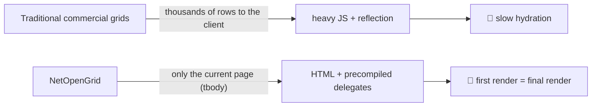
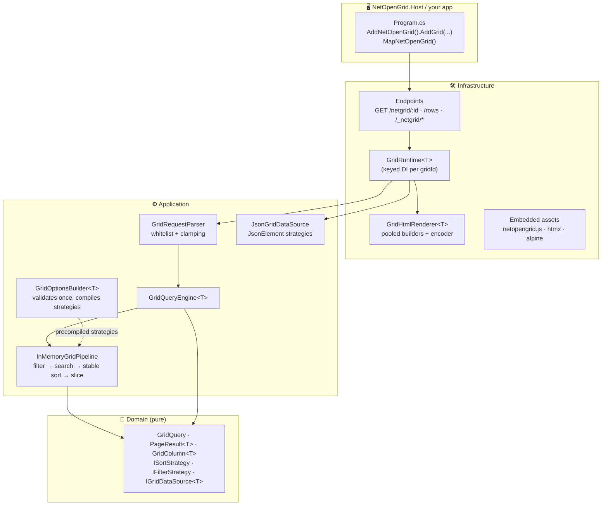
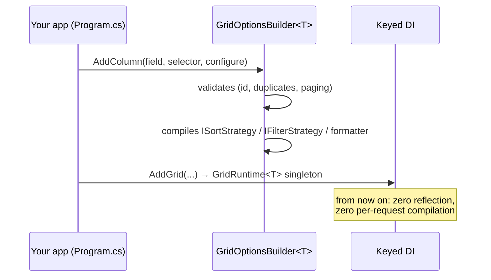
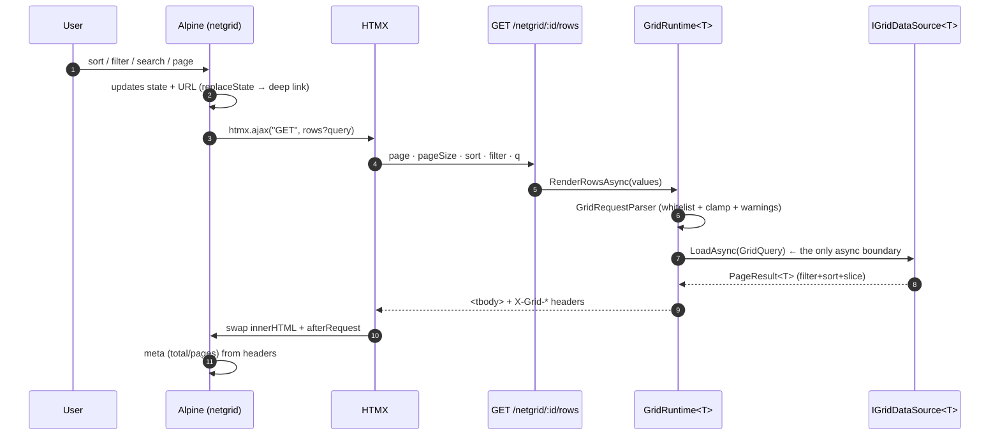
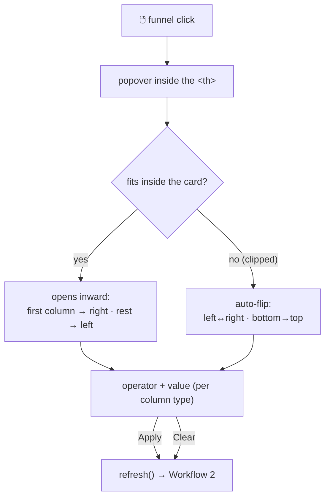
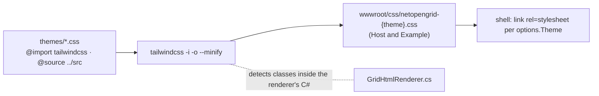

<div align="center">

[](README.md)
[](README.en.md)

# ⚡ NetOpenGrid

**The .NET 10 grid built on a different architecture: server-rendered HTML + precompiled delegates.**

No virtual DOM. No reflection on the hot path. No per-request expression compilation.

[](https://dotnet.microsoft.com)
[](https://learn.microsoft.com/dotnet/csharp/)
[](https://tailwindcss.com)
[](https://htmx.org)
[](https://alpinejs.dev)
[](#-testing)
[](LICENSE)

</div>

---

## 📖 Table of contents

- [Why it exists](#-why-it-exists)
- [Stack](#-stack)
- [Architecture](#-architecture)
- [Quickstart](#-quickstart)
- [Workflows](#-workflows)
- [EF Core (SQL push-down)](#-ef-core-sql-push-down)
- [Configuration reference](#-configuration-reference)
- [Column types & operators](#-column-types--operators)
- [Client ↔ server contract](#-client--server-contract)
- [JSON mode](#-json-mode)
- [Themes (Tailwind v4)](#-themes-tailwind-v4)
- [Performance](#-performance)
- [Project layout](#-project-layout)
- [Testing](#-testing)
- [Roadmap](#-roadmap)
- [License](#-license)

---

## 🧭 Why it exists

Traditional commercial grid suites ship thousands of rows to the client and pay for it with massive
JS bundles and reflection. **NetOpenGrid flips the model**: the server renders only the current page's
`<tbody>`, and all the intelligence (filter, sort, search, paging) runs on
**delegates compiled exactly once** when the grid is configured.



> **Golden rule of the project:** zero reflection and zero `Expression.Compile` per request.
> Everything is compiled while building the options; the hot path only invokes delegates.

---

## 🧱 Stack

| Layer | Technology | Role |
|---|---|---|
| 🔩 Runtime | **.NET 10 / C# 14** (`net10.0`) | records, collection expressions, keyed DI, `ValueTask` |
| 🖥️ Server | **ASP.NET Core** Minimal APIs | shell + fragment + embedded-asset endpoints |
| ⚡ Reactivity | **HTMX 2** | `htmx.ajax` swaps only the `<tbody>` |
| 🪶 Local state | **Alpine.js 3** | paging, filters, selection, theme — no framework |
| 🎨 Styling | **Tailwind CSS v4** (standalone CLI) | themes compiled to `wwwroot/css`, dark mode |
| 🗄️ Database | **EF Core 10** (optional) | filter/sort push-down to SQL |
| ✅ Testing | **xUnit** + `WebApplicationFactory` | unit + real HTTP integration tests |

---

## 🏛️ Architecture

Dependencies point inward (DDD). The client never sees the Domain.



---

## 🚀 Quickstart

> Reference project: [`samples/NetOpenGrid.Example`](samples/NetOpenGrid.Example)

**1. Register the grid** (options are validated and compiled **once**, at startup):

```csharp
using NetOpenGrid.Infrastructure;

builder.Services.AddNetOpenGrid(o =>        // optional: asset/css routes
{
    o.AssetPrefix = "/_netgrid";            // js + htmx + alpine served by the component
    o.CssPath = "/css";                     // where YOUR compiled theme css lives
})
.AddGrid<Employee>("employees",
    options => options
        .WithTitle("Employees")
        .WithTheme("grid")
        .WithDefaultPageSize(10)
        .EnableRowSelection(e => e.Id.ToString("D"))
        .AddColumn("fullName", e => e.FullName, c => c.Header("Full name").Searchable())
        .AddColumn("salary", e => e.Salary, c => c
            .Header("Salary")
            .Align(ColumnAlign.End)
            .Format(v => v.ToString("C0", CultureInfo.GetCultureInfo("en-US"))))
        .AddColumn("hiredOn", e => e.HiredOn, c => c.Format(d => d.ToString("yyyy-MM-dd"))),
    (_, opts) => new InMemoryGridDataSource<Employee>(opts, EmployeeData.All));
```

**2. Map the endpoints** (shell + fragment + component assets):

```csharp
app.UseStaticFiles();     // only for your theme css
app.MapNetOpenGrid();     // GET /netgrid/:id · /rows · /_netgrid/*
```

**3. Open `http://localhost:PORT/netgrid/employees`.** That's it: the component serves its own
JS (Alpine + HTMX embedded in the assembly) — nothing to copy into `wwwroot`.

---

## 🔄 Workflows

### Workflow 1 — Startup (build time, once)



### Workflow 2 — User interaction (the hot path)



### Workflow 3 — Filter popover (Excel-style)



### Workflow 4 — Themes (Tailwind v4)



---

## 🗄️ EF Core (SQL push-down)

`EFCoreGridDataSource<T>` composes `Where` / `OrderBy` / `Skip` / `Take` on your `IQueryable<T>`
using **the same columns, operators and parsing rules** as the in-memory grid.

```csharp
builder.Services.AddDbContext<AppDb>(o => o.UseSqlite(cs));

services.AddNetOpenGrid().AddGrid<Employee>("employees",
    options => options
        .AddColumn(e => e.FullName, c => c.Searchable())   // ← use the Expression overloads
        .AddColumn(e => e.Salary)
        .AddColumn(e => e.HiredOn),
    (sp, opts) => new EFCoreGridDataSource<Employee>(
        opts,
        sp,
        (sp, db) => db.Set<Employee>().AsNoTracking()));
```

Important rules:

| Rule | Detail |
|---|---|
| 🧾 **Expression columns** | For push-down, define columns with the `AddColumn(e => e.Prop, …)` overloads. If a sortable/filterable/searchable column only has a `Func`, construction fails with an error listing the offending fields. |
| 🔤 **Strings via `LIKE`** | `contains/starts-with/ends-with/equals` translate to `EF.Functions.Like` (case-insensitive under default collations; wildcards escaped). |
| 🔢 **Values parsed once** | The filter literal is parsed with the **same** invariant parser as the in-memory pipeline and embedded as a constant in the tree. |
| 🧵 **Scoped DbContext** | The data source creates an `IServiceScope` per request — a scoped `DbContext` works as-is. |
| ↩️ **Stable ordering** | SQL does not guarantee stable ties: add a sort on a unique column for deterministic paging. |

---

## 📋 Excel-style filters (per-value counts)

Text, enum and boolean columns show a **checklist of distinct values with counts** in the popover:

- Counts respect the current context (search + other filters) and **ignore the column's own filter** — classic Excel semantics.
- In-list search, *Select all* and a truncation notice (`FilterValuesLimit`, default 200).
- Applying generates an `in` filter:

```
filter=category:in:["Books","Toys"]
```

- Values endpoint (used by the popover, handy for your own UI too):

```
GET /netgrid/:id/values?field=category&<context>
→ {"field":"category","totalDistinct":5,"limit":200,"values":[{"value":"Books","count":28},…]}
```

Implemented across all three engines: in-memory (snapshot grouping), JSON (`JsonElement`) and EF Core (`GROUP BY` translated to SQL). Numeric/date columns keep the operator popover.

---

## 📌 Pinned & reorderable columns

```csharp
.AddColumn("sku", p => p.Sku, c => c.Header("SKU").Pinned())
```

- **Pinned**: `position: sticky` on `th`/`td` with offsets computed by JS after every render/resize — the column stays visible during horizontal scroll (the selection column is always pinned).
- **Reorderable**: drag a `th` to reorder. Order persists in `localStorage` per grid and travels to the server as `cols=field1,field2,…`; the renderer validates against the whitelist (unknown fields are ignored, unlisted ones are appended in default order).

---

## 📚 Configuration reference

### `GridOptionsBuilder<T>`

| Method | Default | Description |
|---|---|---|
| `.WithId(id)` | — | **Required.** `^[A-Za-z][A-Za-z0-9_-]{0,63}$` |
| `.WithTitle / .WithSubtitle` | `"Data grid"` | Shell header |
| `.WithDefaultPageSize(n)` | `25` | Clamped to `[1, MaxPageSize]` |
| `.WithMaxPageSize(n)` | `500` | Hard server ceiling |
| `.WithPageSizeChoices([...])` | `[10,25,50,100]` | Sorted and deduplicated |
| `.WithDebounce(ms)` | `300` | Global search |
| `.WithTheme(name)` | `"grid"` | Compiles to `netopengrid-{name}.css` |
| `.WithMinHeight(css)` | `"64rem"` | ≈25 rows; prevents collapse while filtering. `""` disables it |
| `.WithEmptyMessage(msg)` | `"No records found."` | Centered empty state |
| `.EnableRowSelection(keyFn)` | off | Floating bar + export; `keyFn` must be stable and unique |
| `.WithNavLinks(...)` | `[]` | Shell navigation |

### `GridColumnBuilder<T, TKey>`

| Method | Default | Description |
|---|---|---|
| `.Header(text)` | humanized name | `birthDate` → "Birth date" |
| `.Selector(Func)` / `.Selector(Expression)` | — | The expression is compiled **once** here (and kept for EF push-down) |
| `.Format(Func<TKey,string?>)` | `DefaultValueFormatter` | Invariant culture, no boxing |
| `.RawCellHtml(Func<T,string?>)` | — | ⚠️ Trusted HTML (badges); everything else is always encoded |
| `.Sortable / .Filterable / .Searchable` | `true/true/auto` | `auto`: search only on text columns |
| `.AllowedOps(FilterOpSet)` | `All` | **Intersected** with what the type supports |
| `.Comparer / .Parser / .SearchMatch` | built-ins | Reflection-free overrides |
| `.Align / .WidthCss / .Visible` | `Start/–/true` | Presentation |
| `.DataType(...)` | inferred | `Text · Numeric · Date · Boolean · Enum · Unknown` |

### Assets (served by the component, embedded in the assembly)

| Option | Default | Description |
|---|---|---|
| `o.AssetPrefix` | `/_netgrid` | Prefix for `netopengrid.js` + `vendor/*` |
| `o.CssPath` | `/css` | Where **your** theme css is served from |
| `o.CssFilePrefix` | `netopengrid-` | Naming: `netopengrid-{theme}.css` |

Caching: `Cache-Control: immutable` + `?v={sha256-12}` — zero copying into `wwwroot`.

---

## 🎛️ Column types & operators

Popover operators are **intersected** while building the options:
`what you ask for ∩ type preset ∩ actual strategy capability`. The UI can never
request an operator the engine cannot execute.

| Type (TKey) | Preset | Operators |
|---|---|---|
| `string` | Text | `equals` · `not-equals` · `contains` · `starts-with` · `ends-with` · `is-empty` · `is-not-empty` |
| numerics, `DateOnly`, `DateTime`, `DateTimeOffset` | Numeric | `equals` · `not-equals` · `gt` · `gte` · `lt` · `lte` |
| `enum` | Equality | `equals` · `not-equals` |
| `bool` | Equality | `equals` · `not-equals` |
| others (classes) | Equality | `equals` · `not-equals` (textual comparison) |

Compact symbols accepted in the query: `=` `!=` `>` `>=` `<` `<=` `~` (contains).

---

## 📡 Client ↔ server contract

| Param | Example | Notes |
|---|---|---|
| `page` | `2` | 1-based |
| `pageSize` | `25` | clamped to `MaxPageSize` |
| `sort` | `salary:desc` (repeatable) | shift-click = stable multi-sort |
| `filter` | `city:contains:li` · `amount:>=100` · `status:is-empty` | per-column whitelist |
| `q` | `nico` | global search (OR across `Searchable` columns) |

**Response** (`<tbody>` fragment + headers):

| Header | Meaning |
|---|---|
| `X-Grid-Total` | Total after filtering (not paging) |
| `X-Grid-Page` / `X-Grid-Page-Size` | Served page (normalized) |
| `X-Grid-Page-Count` | Total pages |
| `Cache-Control: no-store` | Always fresh |

🔗 **Free deep links**: state lives in the URL — share
`?sort=salary:desc&filter=department:equals:design` and the grid opens exactly like that
(the shell server-renders that view and Alpine seeds it).

---

## 🧊 JSON mode

Same pipeline, `JsonElement` rows. No reflection: "selectors" are property names.

```csharp
var options = new JsonGridOptionsBuilder()
    .WithId("orders")
    .AddColumn("customer", c => c.Searchable())
    .AddColumn("amount", c => c.AllowedOps(FilterOpSet.Numeric))
    .Build();

services.AddNetOpenGrid().AddGrid(options, (_, o) => new JsonGridDataSource(o, json));
// also: new JsonGridDataSource(o, streamLoader) · JsonGridDataSource.FromFileAsync(...)
```

Missing properties behave like `null` (sorts lowest, `is-empty` ✓).

---

## 🎨 Themes (Tailwind v4)

```bash
./tools/build-themes.sh     # compiles themes/*.css → wwwroot/css (Host and Example)
```

- Themes use `@source "../src"`: **Tailwind scans the renderer's C#** and detects the classes the
  server emits — no dead CSS, no manual safelist.
- `@custom-variant dark (&:where(.dark, .dark *))` + toggle persisted in `localStorage`
  (inline anti-FOUC script in the shell).
- Create your own by copying `themes/grid.css` and tweaking `@theme { --color-brand-*: … }`.

---

## 🏎️ Performance

| Decision | Why |
|---|---|
| Precompiled delegates per column | Zero reflection/`Compile` on the hot path |
| Closed-parser table (`int`, `decimal`, `DateOnly`, `Guid`…) | No `MakeGenericType`, no `Activator` |
| Stable multi-sort with decorated index array | 1 allocation, deterministic ties, no LINQ chains |
| Renderer: pooled `StringBuilder` + direct `HtmlEncoder` | Zero intermediate strings per cell |
| Fragment = `<tbody>` only | The smallest possible payload per interaction |
| `ValueTask` only at the data boundary | Async where it matters, CPU-bound work sync by design |
| Embedded assets with `?v=hash` | 1 request, immutable cache, no build steps |
| EF: literals parsed once, embedded as constants | SQL push-down with the same pipeline rules |

---

## 🗂️ Project layout

```
NetOpenGrid.slnx
├─ src/
│  ├─ NetOpenGrid.Domain/              💎 pure model (queries, columns, strategies, contracts)
│  ├─ NetOpenGrid.Application/         ⚙️ builders, parser, pipeline, engine, JSON mode
│  ├─ NetOpenGrid.Infrastructure/      🛠️ keyed-DI runtime, renderer, endpoints, embedded assets
│  ├─ NetOpenGrid.Persistence.EFCore/  🗄️ EFCoreGridDataSource<T> (SQL push-down)
│  └─ NetOpenGrid.Host/                🖥️ demo (employees <T> + orders JSON + CSV export)
├─ samples/NetOpenGrid.Example/        📦 minimal consumer example
├─ themes/                             🎨 Tailwind v4 sources (grid, midnight)
├─ tests/                              ✅ Domain · Application · EFCore · Integration
└─ tools/                              🔧 build-themes.sh/.cmd · fetch-vendor.sh
```

---

## ✅ Testing

```bash
dotnet test
```

- **Domain**: paging, operators, results.
- **Application**: builders (validation), parser (whitelist/clamps/symbols), pipeline (filter+sort+slice,
  stability, nulls-first), per-type strategies (string/num/date/enum/bool), full JSON mode.
- **EFCore**: SQL translation on in-memory SQLite (per-type filters, OR search, sort, paging) and
  **result parity** against the in-memory pipeline over the same data.
- **Integration**: real HTTP over `WebApplicationFactory` — sorting, filters, search, meta headers,
  shell deep-link, 404s, CSV export and embedded assets (`/_netgrid/*`, content-type and caching).

---

## 🗺️ Roadmap

- [x] `EFCoreGridDataSource<T>`: filter/sort push-down to SQL reusing the same strategies
- [x] Excel-style filters with per-value counts
- [x] Pinned and reorderable columns
- [ ] Client label i18n
- [ ] Generic server-side export (CSV/Excel) as part of the component

---

## 📄 License

[MIT](LICENSE) — use, modify and distribute freely; attribution lives in the file.

---

<div align="center">

**NetOpenGrid** — *server-first grids for .NET 10*

`dotnet run --project samples/NetOpenGrid.Example` → `http://localhost:5188/netgrid/products`

[](README.md)
[](README.en.md)

</div>
