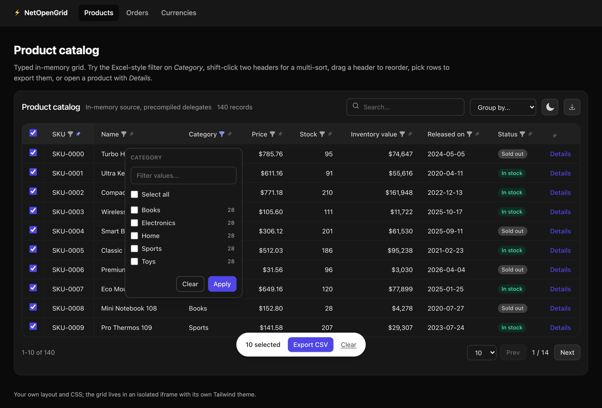
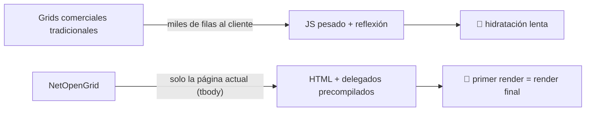
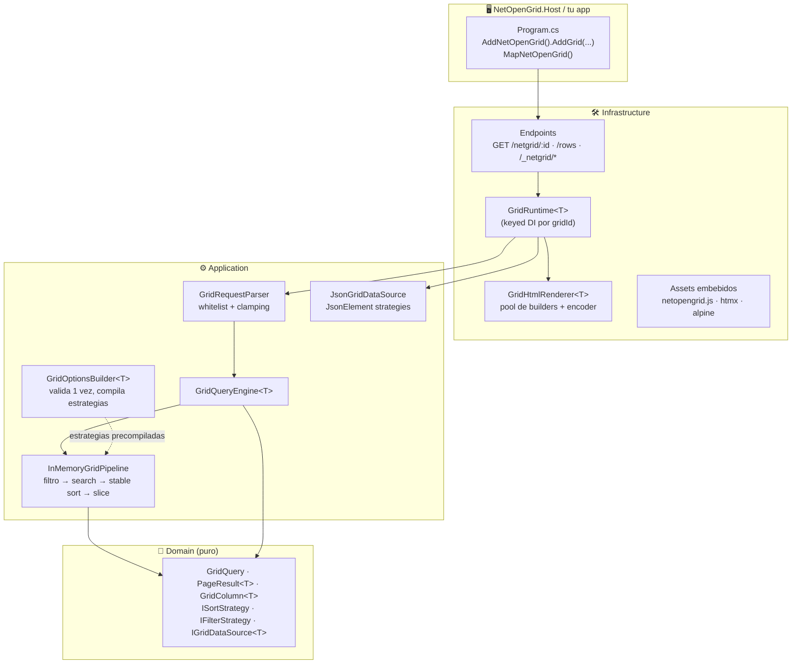
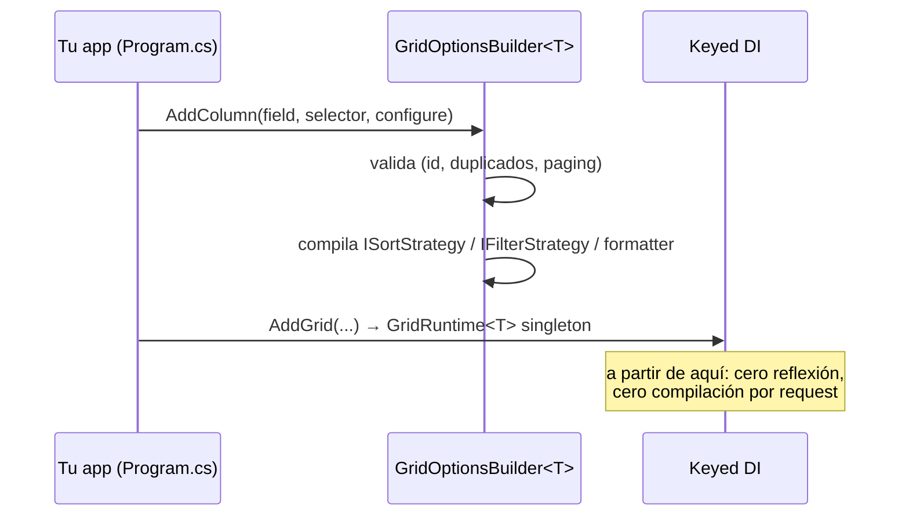
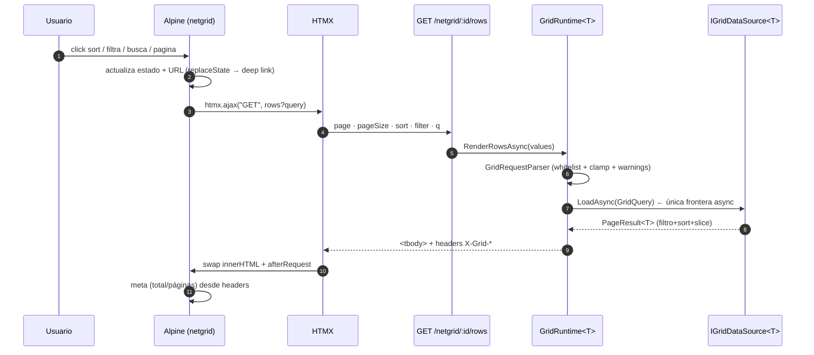
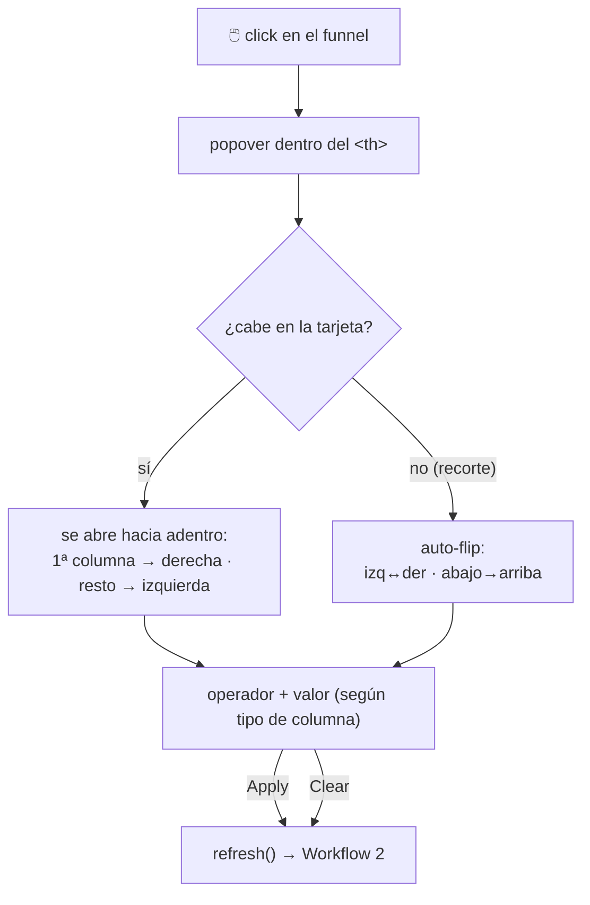
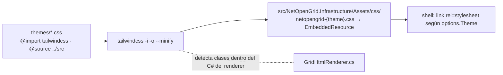
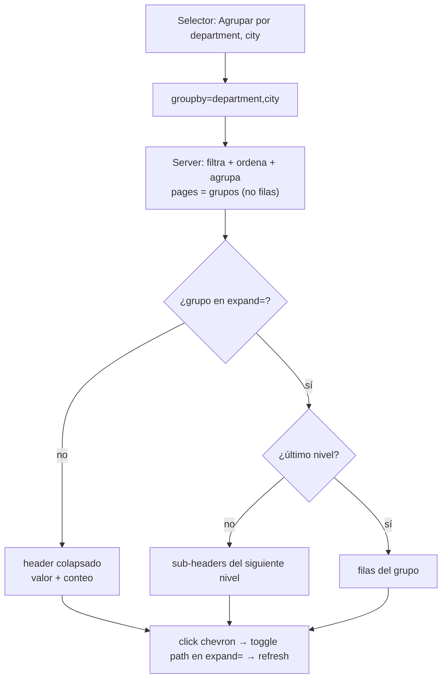
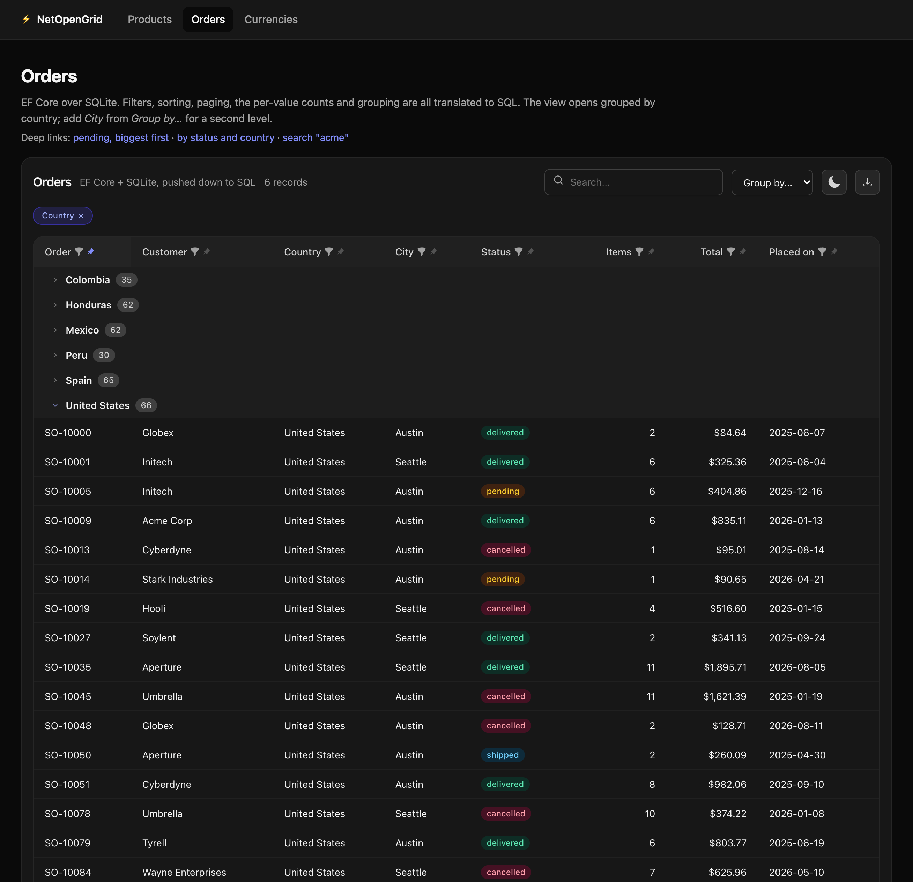

<div align="center">

[](README.md)
[](README.en.md)

# ⚡ NetOpenGrid

**El grid para .NET 10 que apuesta por otra arquitectura: HTML del servidor + delegados precompilados.**

Sin virtual DOM. Sin reflexión en el hot path. Sin compilar expresiones por request.

[](https://dotnet.microsoft.com)
[](https://learn.microsoft.com/dotnet/csharp/)
[](https://tailwindcss.com)
[](https://htmx.org)
[](https://alpinejs.dev)
[](#-testing)
[](LICENSE)
[](https://www.nuget.org/packages/NetOpenGrid)
[](https://github.com/mchinchilla/NetOpenGrid/actions/workflows/publish.yml)

</div>



---

## 📖 Tabla de contenidos

- [Por qué existe](#-por-qué-existe)
- [✨ Features](#-features)
- [Stack](#-stack)
- [Arquitectura](#-arquitectura)
- [Instalación](#-instalación)
- [Quickstart](#-quickstart)
- [Grid en una vista Razor](#-grid-en-una-vista-razor)
- [Workflows](#-workflows)
- [EF Core (push-down a SQL)](#-ef-core-push-down-a-sql)
- [Filtros tipo Excel (conteo por valor)](#-filtros-tipo-excel-conteo-por-valor)
- [Columnas fijadas, reordenables, redimensionables y ocultables](#-columnas-fijadas-reordenables-redimensionables-y-ocultables)
- [Fila clicable y acciones por fila](#️-fila-clicable-y-acciones-por-fila)
- [Export server-side (CSV y Excel)](#-export-server-side-csv-y-excel)
- [i18n](#-i18n)
- [Agrupamiento por columna (anidado)](#-agrupamiento-por-columna-anidado)
- [Agregados (SUM · AVG · MIN · MAX)](#-agregados-sum--avg--min--max)
- [Teclado y accesibilidad](#️-teclado-y-accesibilidad)
- [Vistas guardadas](#-vistas-guardadas)
- [Scroll virtual](#-scroll-virtual)
- [Referencia de configuración](#-referencia-de-configuración)
- [Tipos de columna y operadores](#-tipos-de-columna-y-operadores)
- [Contrato cliente ↔ servidor](#-contrato-cliente--servidor)
- [Modo JSON](#-modo-json)
- [Temas (Tailwind v4)](#-temas-tailwind-v4)
- [Rendimiento](#-rendimiento)
- [Estructura del proyecto](#-estructura-del-proyecto)
- [Testing](#-testing)
- [Roadmap](#-roadmap)
- [Licencia](#-licencia)

---

## 🧭 Por qué existe

Las suites de grid comerciales tradicionales muestran miles de filas en el cliente y pagan el precio en
JS masivo y reflexión. **NetOpenGrid invierte el modelo**: el servidor renderiza solo el `<tbody>` de la
página actual y toda la inteligencia (filtro, orden, búsqueda, paginado) se ejecuta sobre
**delegados compilados una sola vez** al configurar el grid.



> **Regla de oro del proyecto:** cero reflexión y cero `Expression.Compile` por request.
> Todo se compila al construir las opciones; el hot path solo invoca delegados.

---

---

## ✨ Features

| Categoría | Feature | Detalle |
|---|---|---|
| 📊 **Datos** | Fuentes plugables | `InMemoryGridDataSource<T>` · `JsonGridDataSource` (`JsonElement`) · `EFCoreGridDataSource<T>` (push-down SQL) |
| | Tipado sin reflexión | Selectores delegado o expresión; estrategias sort/filter/search compiladas 1 vez al arrancar |
| 🔍 **Filtros** | Por operador | 11 operadores con whitelist por tipo de columna (texto/num/fecha/enum/bool) |
| | Estilo Excel | Checklist de valores distintos **con conteos** (contexto Excel: ignora el filtro propio) |
| | Búsqueda global | `q` con debounce, OR sobre columnas `Searchable` |
| ↕️ **Orden** | Multi-sort estable | Shift-click, ties deterministas (array decorado), nulls primero |
| 🗂️ **Agrupamiento** | Anidado hasta 3 niveles | `groupby` + `expand` en URL; headers con chevron y conteo; grupos se paginan |
| ➕ **Agregados** | SUM · AVG · MIN · MAX | Totales arriba/abajo y subtotales por grupo, sobre todo el conjunto filtrado; push-down a SQL |
| 📄 **Paginación** | Server-side | Clamp de `pageSize`, meta por headers, deep-linking total |
| ☑️ **Selección** | Filas + export | Barra flotante, select-all, CSV de selección o del dataset filtrado completo |
| 📌 **Columnas** | Pin + reorder | Sticky con offsets calculados, drag & drop persistido en `localStorage` |
| 🌐 **i18n** | Presets EN/ES | ~39 claves, override por clave, blob `__NETGRID__.locale` para el cliente |
| 🎨 **Temas** | Tailwind v4 | Presets `grid`/`midnight`, dark mode persistido, escaneo de clases en C# |
| 🔌 **Self-contained** | Assets embebidos | JS + HTMX + Alpine dentro del ensamblado, servidos con `?v={sha}` inmutable |
| 🖱️ **Filas** | Clicables + acciones | `WithRowLink` y `WithRowActions` (links y eventos `netgrid:action` para tu página) |
| 🔖 **Vistas** | Predefinidas + del usuario | `AddView(...)` en el servidor; cada usuario guarda las suyas en su navegador |
| 🔗 **Deep links** | Estado en URL | `page·pageSize·sort·filter·q·groupby·expand·cols·hide` — comparte la vista exacta |
| ♿ **A11y** | aria-labels localizados | Roles, `aria-sort`, `aria-expanded`, focus rings, `x-cloak` |
| ⌨️ **Teclado** | Tabindex móvil | Flechas entre celdas, PageUp/PageDown, Enter/Espacio; el cuerpo es una sola parada de Tab |

## 🧱 Stack

| Capa | Tecnología | Rol |
|---|---|---|
| 🔩 Runtime | **.NET 10 / C# 14** (`net10.0`) | records, collection expressions, keyed DI, `ValueTask` |
| 🖥️ Server | **ASP.NET Core** Minimal APIs | endpoints de shell + fragmento + assets embebidos |
| ⚡ Reactividad | **HTMX 2** | `htmx.ajax` para intercambiar solo el `<tbody>` |
| 🪶 Estado local | **Alpine.js 3** | paginación, filtros, selección, tema — sin framework |
| 🎨 Estilos | **Tailwind CSS v4** (CLI standalone) | themes compilados al ensamblado, dark mode |
| 🗄️ Base de datos | **EF Core 10** (opcional) | push-down de filtros/orden a SQL |
| ✅ Testing | **xUnit** + `WebApplicationFactory` | unitarias + integración HTTP end-to-end |

---

## 🏛️ Arquitectura

Dependencias fluyen hacia adentro (DDD). El cliente nunca ve el Domain.



---

## 📦 Instalación

Los paquetes se publican en [NuGet](https://www.nuget.org/packages?q=NetOpenGrid). Cada commit a `main`
publica una versión nueva y crea el tag `vX.Y.Z` correspondiente (ver [`.github/workflows/publish.yml`](.github/workflows/publish.yml)).

| Paquete | Para qué sirve |
|---|---|
| [`NetOpenGrid`](https://www.nuget.org/packages/NetOpenGrid) | **El que instalas en tu app ASP.NET Core.** Meta-paquete sin assembly propio: solo referencia `Infrastructure`, `Application` y `Domain`. |
| [`NetOpenGrid.Infrastructure`](https://www.nuget.org/packages/NetOpenGrid.Infrastructure) | `AddNetOpenGrid()`, `MapNetOpenGrid()`, renderer HTML, assets embebidos, export CSV, i18n. Arrastra `Application` y `Domain`. |
| [`NetOpenGrid.Persistence.EFCore`](https://www.nuget.org/packages/NetOpenGrid.Persistence.EFCore) | Data source sobre `IQueryable` de EF Core: filtros, orden, paginación y conteos se ejecutan en SQL. |
| [`NetOpenGrid.Persistence.Npgsql`](https://www.nuget.org/packages/NetOpenGrid.Persistence.Npgsql) | Data source sobre una conexión Npgsql cruda: el mismo trabajo empujado a PostgreSQL, para apps que no usan EF Core - RepoDb, Dapper o ADO.NET a secas. Tú pones el SELECT. |
| [`NetOpenGrid.Application`](https://www.nuget.org/packages/NetOpenGrid.Application) | Builders, motor de consulta in-memory, estrategias de filtro y modo JSON. Sin dependencia de ASP.NET Core. |
| [`NetOpenGrid.Domain`](https://www.nuget.org/packages/NetOpenGrid.Domain) | Contratos y descriptores (columnas, filtros, orden, paginación, grupos). Sin dependencias. |

```bash
dotnet add package NetOpenGrid
# Opcional, si tu fuente de datos es EF Core:
dotnet add package NetOpenGrid.Persistence.EFCore
# ...o PostgreSQL sin EF Core:
dotnet add package NetOpenGrid.Persistence.Npgsql
```

> Versionado: `MAJOR.MINOR` se controla desde `<VersionPrefix>` en [`Directory.Build.props`](Directory.Build.props);
> el workflow incrementa `PATCH` automáticamente en cada commit. Sube `MAJOR` o `MINOR` ahí cuando haya cambios de API.

---

## 🚀 Quickstart

> Proyecto funcional de referencia: [`samples/NetOpenGrid.Example`](samples/NetOpenGrid.Example)

**1. Registra el grid** (las opciones se validan y compilan **una vez**, al arrancar):

```csharp
using NetOpenGrid.Infrastructure;

builder.Services.AddNetOpenGrid()           // sin config: JS + htmx + Alpine + tema, todo embebido
.AddGrid<Employee>("employees",
    options => options
        .WithTitle("Employees")
        .WithTheme("grid")
        .WithDefaultPageSize(10)
        .EnableRowSelection(e => e.Id.ToString("D"))
        .AddColumn("fullName", e => e.FullName, c => c.Header("Full name").Searchable())
        .AddColumn("salary", e => e.Salary, c => c
            .Header("Salary")
            .Align(ColumnAlign.End)
            .Format(v => v.ToString("C0", CultureInfo.GetCultureInfo("en-US"))))
        .AddColumn("hiredOn", e => e.HiredOn, c => c.Format(d => d.ToString("yyyy-MM-dd"))),
    (_, opts) => new InMemoryGridDataSource<Employee>(opts, EmployeeData.All));
```

**2. Mapea los endpoints** (shell + fragmento + assets del componente, CSS del tema incluido):

```csharp
app.MapNetOpenGrid();     // GET /netgrid/:id · /rows · /_netgrid/* (incluye /css/netopengrid-{tema}.css)
```

**3. Abre `http://localhost:PORT/netgrid/employees`.** Eso es todo: el componente sirve su propio
JS y CSS (Alpine + HTMX + tema Tailwind embebidos en el ensamblado) — no hace falta `wwwroot` ni
`UseStaticFiles()`. Para alojar tu propio CSS en vez del embebido, ver
[CSS propio](#css-propio) más arriba.

---

## 🧩 Grid en una vista Razor

Cada grid se sirve como su propio documento HTML en `/netgrid/{id}`. Para ponerlo dentro de **tus**
vistas Razor, apunta un `<iframe>` a esa URL con `?embed=1`: el grid omite su cromo propio (header del sitio,
fondo de página, ancho máximo, padding) y se pinta transparente, así que se integra con tu layout.

| Por qué un iframe | |
|---|---|
| 🧱 Aislamiento | El tema Tailwind del grid (con su reset de CSS) no toca el CSS de tu sitio, y el tuyo no rompe el grid. |
| 🔗 Mismo origen | Tu página puede ajustar la altura del frame a su contenido: hace scroll la página, no el frame. |
| 🔁 Deep links | El estado del grid vive en el query string; reenvía el query de tu página al frame y `/products?sort=price:desc` funciona tal cual. |
| ↗️ Acciones por fila | Los enlaces con `target="_top"` navegan la página completa, no el frame; las acciones `Event` llegan a tu página por `postMessage` (mismo origen). |

App Razor Pages completa y ejecutable (`dotnet new web` + estos archivos). Abre `http://localhost:PORT/products`.

**1. Paquetes**

```bash
dotnet add package NetOpenGrid
```

**2. CSS del tema.** El grid carga `{CssPath}/netopengrid-{theme}.css`. Copia el
`netopengrid-grid.css` (o `netopengrid-midnight.css`) precompilado desde [`samples/NetOpenGrid.Example/wwwroot/css`](https://github.com/mchinchilla/NetOpenGrid/tree/main/samples/NetOpenGrid.Example/wwwroot/css)
a tu `wwwroot/css/`, o compila `themes/*.css` con el CLI de Tailwind v4 (ver [Temas](#-temas-tailwind-v4)).

**3. `Program.cs`**: registra Razor Pages y el grid, y mapea ambos.

```csharp
using System.Globalization;
using System.Net;
using NetOpenGrid.Application.DataSources;
using NetOpenGrid.Domain.Columns;
using NetOpenGrid.Infrastructure;
using NetOpenGrid.Infrastructure.Endpoints;

var builder = WebApplication.CreateBuilder(args);

builder.Services.AddRazorPages();

var usd = CultureInfo.GetCultureInfo("en-US");

builder.Services.AddNetOpenGrid()
    .AddGrid<Product>("products", grid => grid
        .WithTitle("Product catalog")
        .WithTheme("grid")                          // -> /css/netopengrid-grid.css
        .WithDefaultPageSize(10)
        .WithMinHeight("")                          // the iframe decides the height
        .EnableRowSelection(p => p.Sku)
        .AddColumn(p => p.Sku, c => c.Header("SKU").Pinned())
        .AddColumn(p => p.Name, c => c.Searchable())
        .AddColumn(p => p.Category)
        .AddColumn(p => p.Price, c => c.Align(ColumnAlign.End).Format(v => v.ToString("C2", usd)))
        .AddColumn(p => p.Stock, c => c.Align(ColumnAlign.End))
        .AddColumn(p => p.ReleasedOn, c => c.Format(d => d.ToString("yyyy-MM-dd", CultureInfo.InvariantCulture)))
        .AddColumn("status", p => p.Stock > 0, c => c.Header("Status").RawCellHtml(p => p.Stock > 0
            ? "<span class=\"badge badge-success\">In stock</span>"
            : "<span class=\"badge badge-muted\">Sold out</span>"))
        .AddColumn("open", p => p.Sku, c => c
            .Header("")                             // blank header: a row-action column
            .Sortable(false).Filterable(false).Searchable(false)
            .RawCellHtml(p => $"<a target=\"_top\" href=\"/products/{WebUtility.UrlEncode(p.Sku)}\">Open</a>")),
        (_, options) => new InMemoryGridDataSource<Product>(options, Catalog.Products));

var app = builder.Build();

app.UseStaticFiles();     // wwwroot/css: site.css + netopengrid-grid.css
app.MapNetOpenGrid();     // /netgrid/{id} (+ /rows, /values, /export) and /_netgrid/* assets
app.MapRazorPages();

app.Run();

public enum Category { Electronics, Home, Sports, Toys, Books }

public sealed record Product(string Sku, string Name, Category Category, decimal Price, int Stock, DateOnly ReleasedOn);

public static class Catalog
{
    public static readonly IReadOnlyList<Product> Products = [.. Enumerable.Range(1, 120).Select(i => new Product(
        Sku: $"SKU-{i:D4}",
        Name: $"Product {i}",
        Category: (Category)(i % 5),
        Price: 4.99m + i * 3.25m,
        Stock: i * 7 % 40,
        ReleasedOn: new DateOnly(2024, 1, 1).AddDays(i * 5)))];
}
```

**4. `Pages/_ViewImports.cshtml` y `Pages/_ViewStart.cshtml`**

```cshtml
@addTagHelper *, Microsoft.AspNetCore.Mvc.TagHelpers
```

```cshtml
@{ Layout = "_Layout"; }
```

**5. `Pages/Shared/_Layout.cshtml`**: tu layout, más el script corto que ajusta cada frame del grid a su contenido.

```cshtml
<!doctype html>
<html lang="en">
<head>
    <meta charset="utf-8">
    <meta name="viewport" content="width=device-width, initial-scale=1">
    <title>@ViewData["Title"]</title>
    <link rel="stylesheet" href="~/css/site.css" asp-append-version="true">
</head>
<body>
    <main class="container">@RenderBody()</main>

    <script>
        // Grid frames are same-origin: size each one to its content so the page scrolls, not the frame.
        const fitted = new WeakSet();
        const fitGrid = (frame) => {
            const doc = frame.contentDocument;
            if (!doc?.body || doc.URL === "about:blank" || fitted.has(doc)) return;
            fitted.add(doc);
            // Measure <html>, not <body>: the grid's last margin collapses out of <body>.
            const fit = () => { frame.style.height = `${Math.ceil(doc.documentElement.getBoundingClientRect().height)}px`; };
            new ResizeObserver(fit).observe(doc.documentElement);
            fit();
        };
        for (const frame of document.querySelectorAll("iframe[data-netgrid]")) {
            frame.addEventListener("load", () => fitGrid(frame));
            if (frame.contentDocument?.readyState === "complete") fitGrid(frame);
        }
    </script>
</body>
</html>
```

**6. `Pages/Products.cshtml`**: la vista que aloja el grid.

```cshtml
@page
@{
    ViewData["Title"] = "Products";

    // ?embed=1 drops the standalone chrome. The grid keeps its state in the query string, so
    // forwarding this page's query makes /products?sort=price:desc&groupby=category a deep link.
    var gridSrc = "/netgrid/products?embed=1"
        + (Request.QueryString.HasValue ? "&" + Request.QueryString.Value![1..] : "");
}

<h1>Products</h1>
<p>Any Razor markup can go around the grid.</p>

<iframe class="grid-frame" data-netgrid src="@gridSrc" title="Product catalog"></iframe>
```

**7. `Pages/Product.cshtml`**: el destino de la columna de acción por fila.

```cshtml
@page "/products/{sku}"
@{
    var product = Catalog.Products.FirstOrDefault(p => p.Sku == (string?)RouteData.Values["sku"]);
    ViewData["Title"] = product?.Name ?? "Not found";
}

<p><a href="/products">← Products</a></p>
<h1>@(product?.Name ?? "Product not found")</h1>
@if (product is not null)
{
    <p>@product.Sku · @product.Category · @product.Price.ToString("C2", System.Globalization.CultureInfo.GetCultureInfo("en-US"))</p>
}
```

**8. `wwwroot/css/site.css`**

```css
body { margin: 0; font-family: system-ui, sans-serif; }
@media (prefers-color-scheme: dark) { body { background: #0a0a0a; color: #f5f5f5; } }
.container { max-width: 80rem; margin: 0 auto; padding: 0 16px; }

.grid-frame {
  display: block;
  width: 100%;
  height: 640px;          /* first paint; the layout script then fits it to the grid */
  border: 0;
  color-scheme: normal;   /* must match the grid document, or dark pages get an opaque white frame */
}
```

A tener en cuenta:

- El `color-scheme: normal` del frame importa. Si tu página está en modo oscuro y el esquema de color del
  frame no coincide con el del documento del grid, el navegador pinta el iframe blanco y opaco.
- `WithMinHeight("")` desactiva la altura mínima por defecto del grid (≈25 filas), pensada para páginas standalone.
- La barra de selección envía las claves elegidas a `POST /netgrid/{id}/export` (campo `ids`). Ese endpoint
  es de tu app; el ejemplo completo trae uno. El botón de descarga del toolbar usa el `GET /netgrid/{id}/export` integrado.
- En Razor, escribe `src="@gridSrc"` con la URL armada en código. `src="/x?embed=1@query"` **no** se evalúa,
  porque Razor interpreta `1@query` como una dirección de correo.

El [ejemplo completo](samples/NetOpenGrid.Example) agrega un grid EF Core sobre SQLite (abre agrupado por país,
con deep links), un grid en modo JSON con el tema `midnight` e i18n configurable desde `appsettings.json`.

---

## 🔄 Workflows

### Workflow 1 — Arranque (build time, una sola vez)



### Workflow 2 — Interacción del usuario (el hot path)



### Workflow 3 — Popover de filtros (estilo Excel)



### Workflow 4 — Temas (Tailwind v4)



### Workflow 5 — Agrupamiento anidado



---

## 🗄️ EF Core (push-down a SQL)

`EFCoreGridDataSource<T>` compone `Where` / `OrderBy` / `Skip` / `Take` sobre tu `IQueryable<T>`
usando **las mismas columnas, operadores y reglas de parsing** que el grid in-memory.

```csharp
builder.Services.AddDbContext<AppDb>(o => o.UseSqlite(cs));

services.AddNetOpenGrid().AddGrid<Employee>("employees",
    options => options
        .AddColumn(e => e.FullName, c => c.Searchable())   // ← usa overloads de Expression
        .AddColumn(e => e.Salary)
        .AddColumn(e => e.HiredOn),
    (sp, opts) => new EFCoreGridDataSource<Employee>(
        opts,
        sp,
        scoped => scoped.GetRequiredService<AppDb>().Set<Employee>().AsNoTracking().OrderBy(e => e.Id)));
```

Reglas importantes:

| Regla | Detalle |
|---|---|
| 🧾 **Columnas con Expression** | Para push-down, define las columnas con los overloads `AddColumn(e => e.Prop, …)`. Si una columna ordenable/filtrable solo tiene `Func`, falla al construir con un error que lista los campos. |
| 🔤 **Strings vía `LIKE`** | `contains/starts-with/ends-with/equals` se traducen a `EF.Functions.Like` (insensible a mayúsculas en collations por defecto; wildcards escapados). |
| 🔢 **Valores parseados 1 vez** | El literal del filtro se parsea con el **mismo** parser invariante del pipeline in-memory y se incrusta como constante en el árbol. |
| 🧵 **DbContext con scope** | El data source crea un `IServiceScope` por request — tu `DbContext` registrado como scoped funciona tal cual. |
| ↩️ **Orden estable** | SQL no garantiza estabilidad en empates: agrega un sort por columna única para paginación determinista. |

---

## 📋 Filtros tipo Excel (conteo por valor)

Las columnas de texto, enum y bool muestran un **checklist con valores distintos y conteos** en el popover:

- Los conteos respetan el contexto actual (búsqueda + otros filtros) e **ignoran el propio filtro de la columna** — semántica Excel clásica.
- Búsqueda interna, *Select all* y aviso de truncado (`FilterValuesLimit`, default 200).
- Al aplicar genera un filtro `in`:

```
filter=category:in:["Books","Toys"]
```

- Endpoint de valores (usado por el popover, útil también para tu propio UI):

```
GET /netgrid/:id/values?field=category&<contexto>
→ {"field":"category","totalDistinct":5,"limit":200,"values":[{"value":"Books","count":28},…]}
```

Implementado en los tres motores: in-memory (agrupación en snapshot), JSON (`JsonElement`) y EF Core (`GROUP BY` traducido a SQL). Las columnas numéricas/fecha mantienen el popover de operador.

---

## 📌 Columnas fijadas, reordenables, redimensionables y ocultables

```csharp
.AddColumn("sku", p => p.Sku, c => c.Header("SKU").Pinned())
```

- **Pinned** (izquierda o derecha): `position: sticky` en `th`/`td`; la columna queda visible al hacer scroll horizontal
  (la de selección siempre se fija). `.Pinned()` fija a la izquierda, `.PinnedRight()` a la derecha, y
  `WithRowActions(a => a.Pinned()...)` fija la columna de acciones a la derecha. El botón de pin de cada encabezado
  rota **sin fijar → izquierda → derecha → sin fijar** (el ícono se voltea a la derecha y la etiqueta dice el siguiente paso).
  Las fijadas se agrupan en su borde: izquierda + resto + derecha. El estado se guarda en `localStorage`, incluso
  para desfijar lo que fijó el servidor.
- **Reordenables**: arrastra el `th` para reordenar. El orden se persiste en `localStorage` por grid y viaja al servidor como `cols=field1,field2,…`; el renderer valida contra la whitelist (campos desconocidos se ignoran, los no mencionados se agregan al final en su orden por defecto).
- **Redimensionables**: arrastra el borde derecho de un encabezado; doble clic lo ajusta al contenido de la página
  visible, y `Alt+←` / `Alt+→` sobre un botón del encabezado lo cambia de a 16 px. El primer ajuste congela todas las
  columnas en su ancho actual (`table-layout: fixed`, nada salta); lo que no cabe termina en "…". El mínimo es lo que
  ocupan los botones del encabezado. Los anchos se guardan en `localStorage` por grid. `.WithColumnResize(false)` lo apaga.
- **Mostrar/ocultar**: el botón de columnas de la barra abre una lista con un checkbox por columna y "Mostrar todas"
  (la última columna visible no se puede desmarcar). La elección viaja al servidor como `hide=field1,field2,…`, así
  que filas, totales, grupos y el **export CSV** salen sin esas columnas; se guarda en `localStorage` y en la URL.
  `.WithColumnChooser(false)` lo apaga.

## 🖱️ Fila clicable y acciones por fila

```csharp
.EnableRowSelection(p => p.Sku)          // o .WithRowKey(p => p.Sku) si no quieres selección
.WithRowLink(p => $"/products/{p.Sku}", target: "_top")
.WithRowActions(a => a
    .Link("Details", p => $"/products/{p.Sku}", target: "_top")
    .Event("archive", "Archive", RowActionStyle.Danger, visible: p => p.Available))
```

- **Fila clicable** (`WithRowLink`): un clic en cualquier parte de la fila navega. Se ignoran los clics sobre los
  controles de la fila (checkbox, links, botones) y la selección de texto; `Ctrl`/`⌘`+clic y el clic central abren
  una pestaña nueva. Con teclado, `Enter` sobre una celda sin control abre el link. `target: "_top"` sale del iframe.
- **Acciones** (`WithRowActions`): columna al final con los links y botones de cada fila.
  - `Link(label, href, target?)` → un `<a href>` normal.
  - `Event(name, label)` → un botón que dispara `netgrid:action` con `{ grid, action, key }` en la raíz del grid
    (burbujea hasta `document`). Si el grid está en un iframe, envía el mismo payload con `postMessage` **solo** a un
    padre del mismo origen. El componente no ejecuta nada en el servidor: tu página decide (llamar a tu API, abrir un modal…).
  - `style: RowActionStyle.Danger` las pinta en rojo; `visible:` las oculta por fila; `.Header("…")` cambia el título.
  - `Event` necesita una clave de fila (`WithRowKey` o `EnableRowSelection`); sin ella el grid falla al configurarse.
- **Refrescar** después de una acción: `document.dispatchEvent(new CustomEvent('netgrid:refresh', { detail: { grid: 'products' } }))`,
  o desde la página anfitriona: `frame.contentWindow.postMessage({ type: 'netgrid:refresh', grid: 'products' }, location.origin)`.
- **URLs seguras:** solo se renderizan URLs relativas, `http(s)`, `mailto` y `tel`; `javascript:`, `data:` y
  `vbscript:` se descartan (en el link de la fila y en las acciones).
- Si una celda tiene varios controles, `Enter` entra en ella, `←`/`→` los recorren y `Escape` vuelve a la celda.

```js
// Página anfitriona con el grid en un iframe (ver samples/NetOpenGrid.Example/Pages/Index.cshtml)
window.addEventListener("message", (e) => {
    if (e.origin !== location.origin || e.data?.type !== "netgrid:action") return;
    // e.data.action === "archive", e.data.key === "SKU-0001"
});
```

---

## 📤 Export server-side (CSV y Excel)

`GET /netgrid/:id/export?<contexto>` descarga el **dataset completo** (todas las páginas) con el
filtro, búsqueda, orden, orden de columnas (`cols`) y columnas ocultas (`hide`) actuales. `format=csv` (default) o `format=xlsx`.

```csharp
// sin configuración: MapNetOpenGrid() ya publica la ruta
// GET /netgrid/employees/export?filter=department:equals:Design&sort=id              → employees.csv
// GET /netgrid/employees/export?format=xlsx&filter=department:equals:Design&sort=id  → employees.xlsx
.WithExportFormats(GridExportFormats.Csv | GridExportFormats.Xlsx)   // default: los dos; None quita el export
.AddColumn(p => p.Price, c => c.ExcelFormat("\"$\"#,##0.00"))         // formato de número en Excel
```

- El toolbar trae un botón de descarga (un menú CSV / Excel si están los dos formatos) que exporta la vista actual.
- **Streaming:** itera páginas de `MaxPageSize` y las escribe directo a la respuesta; la memoria no crece con el tamaño del export.
- **Límite:** `.WithMaxExportRows(n)` (default `100_000`; en xlsx además el tope de Excel, 1.048.575 filas). Si el resultado lo supera, responde `422` antes de empezar a escribir.

**CSV** (RFC-4180)
- Los valores usan los formatters de columna (`Format`); `RawCellHtml` se ignora por seguridad.
- **UTF-8 con BOM**, para que Excel abra bien tildes y ñ.
- **Inyección de fórmulas:** las celdas que empiezan con `=` `+` `-` `@` (o tab/CR) llevan un `'` delante; los números como `-12.5` no se tocan.

**Excel (.xlsx)** — sin dependencias: el paquete SpreadsheetML se escribe directo, en streaming.
- **Celdas tipadas:** números como números, fechas como fechas de Excel (`yyyy-mm-dd`, con hora si la tiene), booleanos como
  TRUE/FALSE; enums y texto como texto. El texto va como *inline string*, que Excel nunca evalúa como fórmula.
- `.ExcelFormat("...")` por columna para el formato de número (moneda, porcentaje…); sin él, formato General.
- Encabezado en negrita y fijo, autofiltro, anchos estimados con la primera página y nombre de hoja = título del grid.
- Validado con el validador de Open XML SDK (0 errores) y leído con openpyxl.

---

## 🌐 i18n

Todos los labels del cliente (botones, aria-labels, operadores, contadores, rangos) pasan por
`NetOpenGridLocalizationOptions`: defaults en inglés, preset **español** incluido y override por clave.

```csharp
builder.Services.AddNetOpenGrid(
    o => { o.AssetPrefix = "/_netgrid"; },
    loc => loc.UseCulture("es")                       // preset incluido
              .Set("filter.apply", "Filtrar"));       // override fino
```

- El shell inyecta `__NETGRID__.locale` con el diccionario efectivo: Alpine renderiza chips,
  contadores y rangos con las mismas cadenas (fallbacks EN embebidos en el JS).
- ~39 claves: `search.*`, `pager.*`, `records.*`, `range.*`, `filter.*`, `select.*`, `chips.*`, `ops.*`, `pin.aria`, `theme.aria`, `export.aria`.
- El mensaje de vacío sigue siendo `WithEmptyMessage(...)` (por grid).

---

## 🗂️ Agrupamiento por columna (anidado)



`groupby=field1,field2,…` (hasta 3 niveles) + `expand=` para desplegar grupos. **Los grupos se paginan** (no las filas); expandir un grupo muestra sus sub-grupos o sus filas (estilo DevEx, cada nivel se expande por separado). Estado en la URL → deep-links con grupos abiertos.

```
GET /netgrid/:id/rows?groupby=department,city&expand=department=Design|city=Lima
```

- **Panel de agrupamiento** sobre la tabla: arrastra el encabezado de una columna al panel para agrupar por ella;
  arrastra un chip sobre otro para cambiar el orden de los niveles; la ✕ de cada chip quita ese nivel.
  `.WithGroupPanel(false)` lo quita y deja chips simples.
- El selector "Agrupar por..." del toolbar sigue siendo el camino con teclado.
- Headers de grupo con chevron, conteo de filas y indentación por nivel; valores vacíos → bucket "(Vacíos)".
- El orden de los grupos respeta el sort de la columna agrupada; los sorts restantes ordenan dentro de cada grupo.
- Motores: in-memory y JSON agrupan en memoria; **EF Core** hace push-down de filtro+orden a SQL y construye el árbol sobre las filas coincidentes.

## ➕ Agregados (SUM · AVG · MIN · MAX)

Cada columna numérica declara sus funciones y el grid decide en qué filas mostrarlas. Se calculan sobre
**todo el conjunto filtrado** (todas las páginas), no solo sobre la página visible.

```csharp
.WithAggregateRows(GridAggregateRows.Footer | GridAggregateRows.GroupHeader | GridAggregateRows.GroupFooter)
.AddColumn(p => p.Price, c => c
    .Format(v => v.ToString("C2", usd))
    .Aggregate(GridAggregate.Avg | GridAggregate.Min | GridAggregate.Max))
.AddColumn(p => p.Stock, c => c.Aggregate(GridAggregate.Sum | GridAggregate.Avg))
```

| `GridAggregateRows` | Dónde |
|---|---|
| `Header` | Fila "Total" justo debajo de los encabezados |
| `Footer` | Fila "Total" después de la última fila |
| `GroupHeader` | En la fila de cada grupo, junto a su nombre y conteo (se ve con el grupo colapsado) |
| `GroupFooter` | Fila "Subtotal …" al final de cada grupo expandido |

- Default: `Footer | GroupHeader`. `GridAggregateRows.None` las apaga; `All` las muestra todas.
- Los valores se alinean bajo su columna; las columnas sin agregados del principio se funden en la celda de la etiqueta.
- **Formato:** reutiliza el `.Format(...)` de la columna (`$1,234.50`). `AVG` sobre enteros muestra hasta 2 decimales.
  `.AggregateFormat((fn, value) => ...)` lo reemplaza.
- **Nulls:** se ignoran, como en SQL (`AVG` divide por los valores no nulos). Un conjunto vacío no muestra totales.
- **Motores:** in-memory y JSON calculan en memoria; **EF Core** y **Npgsql** hacen push-down de los totales
  a un solo `SELECT SUM(…), AVG(…), MIN(…), MAX(…)`. Los subtotales de grupo se calculan al armar el árbol de grupos.
- Solo columnas numéricas: `.Aggregate(...)` sobre otro tipo falla al configurar el grid. En EF Core la columna
  necesita el selector de expresión.
- Etiquetas localizadas: `agg.sum`, `agg.avg`, `agg.min`, `agg.max`, `agg.total`, `agg.subtotal`.

## ⌨️ Teclado y accesibilidad

El cuerpo de la tabla es **una sola parada de Tab** (tabindex móvil): los links, checkboxes y chevrons de las
filas salen del orden de Tab y se activan desde la celda.

| Tecla | Acción |
|---|---|
| `←` `→` `↑` `↓` | Moverse entre celdas (respeta `colspan` y las columnas ocultas por breakpoint) |
| `Home` / `End` | Primera / última celda de la fila |
| `Ctrl+Home` / `Ctrl+End` | Primera / última celda de la página |
| `PageUp` / `PageDown` | Página anterior / siguiente, conservando la columna |
| `Alt+←` / `Alt+→` en un encabezado | Angosta / ensancha la columna 16 px |
| `Enter` | Activa el control de la celda (link, checkbox); en una fila de grupo, lo expande o colapsa; en una fila clicable, abre su link; con varios controles, entra en la celda |
| `Espacio` | Selecciona la fila; en una fila de grupo, lo expande o colapsa |
| `↑` en la primera fila | Sube al botón de orden de esa columna; `Enter` ordena, `Shift+Enter` suma al multi-sort |
| `↓` en un encabezado | Baja a la primera fila, en la misma columna |

- Al llegar filas nuevas (orden, página, grupo) el foco vuelve a la misma fila y columna.
- `aria-sort` en cada encabezado ordenable: `ascending` / `descending` en el orden principal, `other` en los
  secundarios de un multi-sort y `none` en el resto. La flecha ▲▼ es `aria-hidden`.
- La tabla conserva su semántica nativa (sin `role="grid"`): los lectores de pantalla siguen usando su
  propia navegación de tablas, y los botones de encabezado (orden, filtro, pin) siguen accesibles con `Tab`.

## 🔖 Vistas guardadas

Una vista es el estado del grid con nombre: orden, filtros, búsqueda, agrupamiento, orden de columnas, columnas
ocultas y tamaño de página (lo mismo que ya vive en la URL). El botón de vistas de la barra tiene tres secciones:

- **Vista por defecto**: vuelve al grid tal como está configurado.
- **Predefinidas**: las define el servidor y las ve todo el mundo.
- **Mis vistas**: cada usuario guarda la vista actual con un nombre (campo al pie del menú); quedan en su navegador
  (`localStorage`), se reemplazan si repites el nombre y se borran con ✕.

```csharp
.AddView("Delivered, biggest first", "filter=status:equals:delivered&sort=total:desc")
.AddView("Pending by country", "filter=status:equals:pending&groupby=country")
.WithSavedViews(false)   // quita "Mis vistas"; las predefinidas siguen
```

- Aplicar una vista reinicia primero todo el estado, así no se arrastra nada de la anterior (un filtro, una columna oculta).
- La vista activa lleva ✓ y el botón se resalta. La página y el tamaño de página no cuentan para saber cuál está activa.
- Las predefinidas se **validan al construir el grid**: nombres (1-60 caracteres, únicos), parámetros permitidos
  (`sort · filter · q · groupby · expand · cols · hide · pageSize`) y que cada campo sea una columna. Un error ahí
  lanza `GridConfigurationException` al arrancar, en vez de mostrar en silencio otra cosa.
- Los anchos y los pines siguen siendo por navegador, no por vista.

## 📜 Scroll virtual

Para listas largas, en vez del paginador: un área con scroll de alto fijo donde las filas llegan del servidor por
bloques mientras bajas, y en el DOM solo quedan los bloques cerca de lo que ves.

```csharp
.WithVirtualScroll(blockSize: 100, height: "70vh")
```

- Cada bloque es una página del endpoint de siempre (`/rows?page=N&pageSize=blockSize`), así que funciona igual con
  in-memory, JSON, EF Core y Npgsql. El tamaño de página pasa a ser el del bloque.
- En el DOM quedan el bloque visible y uno a cada lado; el resto son filas espaciadoras con la altura medida de cada
  bloque (o estimada hasta medirlo), así la barra de scroll representa el total. Los bloques lejanos también se
  descartan de memoria.
- El encabezado queda fijo arriba. Los totales de arriba salen solo en el primer bloque y los de abajo solo en el último.
- Cambiar orden, filtros o búsqueda vuelve al principio y cancela los bloques que estaban en camino.
- Teclado: las flechas cruzan bloques; `PageUp`/`PageDown` avanzan una pantalla y `Ctrl+Home`/`Ctrl+End` van a la
  primera/última fila del total, cargando lo necesario.
- Con agrupamiento el grid vuelve a paginar (los grupos expandibles no tienen alturas uniformes).
- El contenedor lleva `overflow-anchor: none`: sin eso, Chrome "corrige" el scroll al cambiar los bloques y salta al final.

---

## 📚 Referencia de configuración

### `GridOptionsBuilder<T>`

| Método | Default | Descripción |
|---|---|---|
| `.WithId(id)` | — | **Requerido.** `^[A-Za-z][A-Za-z0-9_-]{0,63}$` |
| `.WithTitle / .WithSubtitle` | `"Data grid"` | Encabezado del shell |
| `.WithDefaultPageSize(n)` | `25` | Se clampéa a `[1, MaxPageSize]` |
| `.WithMaxPageSize(n)` | `500` | Techo duro del servidor |
| `.WithPageSizeChoices([...])` | `[10,25,50,100]` | Se ordenan y deduplican |
| `.WithDebounce(ms)` | `300` | Búsqueda global |
| `.WithTheme(name)` | `"grid"` | Compila a `netopengrid-{name}.css` |
| `.WithMinHeight(css)` | `"64rem"` | ≈25 filas; evita el colapso al filtrar. `""` lo desactiva |
| `.WithEmptyMessage(msg)` | `"No records found."` | Estado vacío centrado |
| `.WithMaxExportRows(n)` | `100000` | Tope del export (CSV y xlsx); por encima responde `422` |
| `.AddView(name, query)` | — | Vista predefinida (validada al construir) |
| `.WithSavedViews(bool)` | `true` | Los usuarios guardan sus propias vistas |
| `.WithExportFormats(formats)` | `Csv \| Xlsx` | Formatos del botón y del endpoint de export |
| `.WithColumnResize(bool)` | `true` | Tiradores para redimensionar columnas |
| `.WithColumnChooser(bool)` | `true` | Menú para mostrar/ocultar columnas |
| `.WithVirtualScroll(blockSize, height)` | off | Scroll virtual por bloques en vez de paginador |
| `.WithGroupPanel(bool)` | `true` | Panel para agrupar arrastrando encabezados |
| `.WithAggregateRows(rows)` | `Footer \| GroupHeader` | Filas donde se muestran los agregados |
| `.EnableRowSelection(keyFn)` | off | Barra flotante + export; `keyFn` debe ser estable y único |
| `.WithRowKey(keyFn)` | — | Clave de fila sin activar la selección (la usan las acciones `Event`) |
| `.WithRowLink(hrefFn, target?)` | — | Toda la fila es clicable |
| `.WithRowActions(a => ...)` | — | Columna de acciones: `.Link(...)`, `.Event(...)`, `.Header(...)` |
| `.WithNavLinks(...)` | `[]` | Navegación del shell |

### `GridColumnBuilder<T, TKey>`

| Método | Default | Descripción |
|---|---|---|
| `.Header(text)` | nombre humanizado | `birthDate` → "Birth date" |
| `.Selector(Func)` / `.Selector(Expression)` | — | La expresión se compila **una vez** aquí (y se conserva para push-down EF) |
| `.Format(Func<TKey,string?>)` | `DefaultValueFormatter` | Invariant culture, sin boxing |
| `.RawCellHtml(Func<T,string?>)` | — | ⚠️ HTML de confianza (badges); lo demás siempre se escapa |
| `.Sortable / .Filterable / .Searchable` | `true/true/auto` | `auto`: búsqueda solo en columnas de texto |
| `.AllowedOps(FilterOpSet)` | `All` | Se **intersecta** con lo soportado por el tipo |
| `.Comparer / .Parser / .SearchMatch` | built-ins | Overrides sin reflexión |
| `.Align / .WidthCss / .Visible` | `Start/–/true` | Presentación |
| `.Pinned() / .PinnedRight()` | — | Fija la columna al borde izquierdo / derecho |
| `.DataType(...)` | inferido | `Text · Numeric · Date · Boolean · Enum · Unknown` |
| `.ExcelFormat(numFmt)` | General | Formato de número de la columna en el export xlsx |
| `.Aggregate(GridAggregate)` | `None` | `Sum \| Avg \| Min \| Max`; solo columnas numéricas |
| `.AggregateFormat(Func<GridAggregate,decimal,string?>)` | el `Format` de la columna | Formato propio para los agregados |

### Assets (servidos por el componente, embebidos en el ensamblado)

| Opción | Default | Descripción |
|---|---|---|
| `o.AssetPrefix` | `/_netgrid` | Prefijo para `netopengrid.js` + `vendor/*` + `css/netopengrid-{theme}.css` |
| `o.CssPath` | `null` | Si se asigna, sirve **tu** css de themes desde esa ruta en vez del tema embebido |
| `o.CssFilePrefix` | `netopengrid-` | Nomenclatura de tu css propio; solo aplica si `CssPath` está asignado |

Caché: `Cache-Control: immutable` + `?v={sha256-12}` — cero trabajo de copiado a `wwwroot` con el tema embebido por defecto.

---

## 🎛️ Tipos de columna y operadores

Los operadores ofrecidos en el popover se **intersectan** al construir las opciones:
`lo que pides ∩ preset por tipo ∩ capacidad real de la estrategia`. La UI nunca puede
pedir un operador que el motor no sepa ejecutar.

| Tipo (TKey) | Preset | Operadores |
|---|---|---|
| `string` | Text | `equals` · `not-equals` · `contains` · `starts-with` · `ends-with` · `is-empty` · `is-not-empty` |
| numéricos, `DateOnly`, `DateTime`, `DateTimeOffset` | Numeric | `equals` · `not-equals` · `gt` · `gte` · `lt` · `lte` |
| `enum` | Equality | `equals` · `not-equals` |
| `bool` | Equality | `equals` · `not-equals` |
| otros (clases) | Equality | `equals` · `not-equals` (comparación textual) |

Símbolos compactos aceptados en la query: `=` `!=` `>` `>=` `<` `<=` `~` (contains).

---

## 📡 Contrato cliente ↔ servidor

| Param | Ejemplo | Notas |
|---|---|---|
| `page` | `2` | 1-based |
| `pageSize` | `25` | clamp a `MaxPageSize` |
| `sort` | `salary:desc` (repetible) | shift-click = multi-sort estable |
| `filter` | `city:contains:li` · `amount:>=100` · `status:is-empty` | whitelist por columna |
| `q` | `nico` | búsqueda global (OR sobre columnas `Searchable`) |
| `groupby` | `department,city` | agrupamiento anidado (máx 3 niveles); los grupos se paginan |
| `expand` | `department=Design\|city=Lima` | rutas de grupos desplegados (valores URL-encoded) |
| `cols` | `email,fullName` | orden de columnas (drag & drop; validado, faltantes se agregan al final) |
| `format` | `xlsx` | solo en `/export`: `csv` (default) o `xlsx` |
| `hide` | `email,city` | columnas ocultas (menú de columnas; validado, nunca oculta todas) |

**Respuesta** (fragmento `<tbody>` + headers):

| Header | Significado |
|---|---|
| `X-Grid-Total` | Total tras filtro (no paginado) |
| `X-Grid-Page` / `X-Grid-Page-Size` | Página servida (normalizada) |
| `X-Grid-Page-Count` | Total de páginas |
| `Cache-Control: no-store` | Siempre fresco |

🔗 **Deep links gratis**: el estado vive en la URL — comparte `?sort=salary:desc&filter=department:equals:design`
y el grid abre exactamente así (el shell server-renderiza esa vista y Alpine la siembra).

---

## 🧊 Modo JSON

Mismo pipeline, filas `JsonElement`. Sin reflexión: los "selectores" son nombres de propiedad.

```csharp
var options = new JsonGridOptionsBuilder()
    .WithId("orders")
    .AddColumn("customer", c => c.Searchable())
    .AddColumn("amount", c => c.AllowedOps(FilterOpSet.Numeric))
    .Build();

services.AddNetOpenGrid().AddGrid(options, (_, o) => new JsonGridDataSource(o, json));
// también: new JsonGridDataSource(o, streamLoader) · JsonGridDataSource.FromFileAsync(...)
```

Propiedades faltantes se comportan como `null` (orden inferior, `is-empty` ✓).

---

## 🎨 Temas (Tailwind v4)

```bash
./tools/build-themes.sh              # compila themes/*.css → Infrastructure/Assets/css
./tools/build-themes.sh --strict     # falla si el CLI de tailwindcss no está en el PATH
```

- La salida se compila **dentro del ensamblado** como `EmbeddedResource` y la sirve
  `MapNetOpenGrid` en `{AssetPrefix}/css/netopengrid-{tema}.css`. Las apps que consumen
  el paquete no necesitan `wwwroot` ni Tailwind. `tools/pack.sh` siempre usa `--strict`,
  así que nunca se publica un paquete sin CSS compilado.
- Los themes usan `@source "../src"`: **Tailwind escanea el C# del renderer** y detecta las clases
  que emite el servidor — por eso no hay CSS muerto ni safelist manual.
- `@custom-variant dark (&:where(.dark, .dark *))` + toggle persistido en `localStorage`
  (script anti-FOUC inline en el shell).
- Crea el tuyo copiando `themes/grid.css` y ajustando `@theme { --color-brand-*: … }`.

---

## 🏎️ Rendimiento

| Decisión | Por qué |
|---|---|
| Delegados precompilados por columna | Cero reflexión/`Compile` en el hot path |
| Tabla de parsers cerrados (`int`, `decimal`, `DateOnly`, `Guid`…) | Sin `MakeGenericType` ni `Activator` |
| Stable multi-sort con array decorado de índices | 1 allocación, ties deterministas, sin cadenas LINQ |
| Renderer con `StringBuilder` pooled + `HtmlEncoder` directo | Cero strings intermedios por celda |
| Fragmento = solo `<tbody>` | El payload mínimo posible por interacción |
| `ValueTask` solo en la frontera de datos | Async donde importa, CPU sync por diseño |
| Assets embebidos con `?v=hash` | 1 request, caché inmutable, sin build steps |
| EF: literales parseados 1 vez e incrustados como constantes | Push-down a SQL con las mismas reglas del pipeline |

---

## 🗂️ Estructura del proyecto

```
NetOpenGrid.slnx
├─ src/
│  ├─ NetOpenGrid.Domain/              💎 modelo puro (queries, columnas, estrategias, contratos)
│  ├─ NetOpenGrid.Application/         ⚙️ builders, parser, pipeline, engine, modo JSON
│  ├─ NetOpenGrid.Infrastructure/      🛠️ runtime keyed-DI, renderer, endpoints, assets embebidos
│  ├─ NetOpenGrid.Persistence.EFCore/  🗄️ EFCoreGridDataSource<T> (push-down a SQL)
│  └─ NetOpenGrid.Host/                🖥️ demo (employees <T> + orders JSON + export CSV)
├─ samples/NetOpenGrid.Example/        📦 app Razor Pages que incrusta 3 grids (in-memory, EF Core, JSON)
├─ themes/                             🎨 fuentes Tailwind v4 (grid, midnight)
├─ tests/                              ✅ Domain · Application · EFCore · Integration
├─ tools/                              🔧 build-themes.sh/.cmd · fetch-vendor.sh · check-js.sh
```

---

## ✅ Testing

```bash
dotnet test
```

**116 tests**: Domain (20) · Application (56) · Integration (27) · EFCore (13).

- **Domain**: paginado, operadores (incl. `In`), resultados.
- **Application**: builders (validación, pin, i18n-safe), parser (whitelist/clamps/símbolos/JSON `in`),
  pipeline (filtro+sort+slice, estabilidad, nulls-first), estrategias por tipo, `GridGrouper`
  (anidado/expand/paginación por grupos/blank bucket), modo JSON completo.
- **EFCore**: traducción a SQL sobre SQLite in-memory (filtros por tipo incl. `In`, búsqueda OR, orden,
  paginado, value-counts con `GROUP BY`, agrupamiento) y **paridad de resultados** contra el pipeline in-memory.
- **Integration**: HTTP real sobre `WebApplicationFactory` — sorting, filtros (operador + `in`), búsqueda,
  agrupamiento renderizado, headers de meta, deep-links (shell + `cols`), 404s, export CSV, i18n (shell ES),
  assets embebidos y salud del runtime JS (anti-regresión).

---

## 🗺️ Roadmap

### ✅ Completado

- [x] `EFCoreGridDataSource<T>`: push-down de filtros/sort a SQL reutilizando las mismas estrategias
- [x] `NpgsqlGridDataSource<T>`: push-down a PostgreSQL con `GridSqlMap` / `GridSqlBuilder`
- [x] Filtros tipo Excel con conteo por valor
- [x] Columnas fijadas (pin) y reordenables
- [x] i18n de labels del cliente
- [x] Agrupamiento por columna (anidado hasta 3 niveles, expand/colapse por URL)
- [x] Export server-side genérico (CSV) como parte del componente

### 🐞 Correcciones y robustez

- [x] Export CSV: neutralizar inyección de fórmulas (celdas que empiezan con `=` `+` `-` `@` tab/CR)
- [x] Export CSV: BOM UTF-8 para que Excel abra bien tildes y ñ
- [x] Export CSV: streaming a `Response.Body` + límite configurable de filas (`MaxExportRows`)
- [x] Cliente: cada grid cancela su propia request en vuelo (`AbortController`); varios grids en una página ya no se pisan
- [x] Cliente: arrastrar columnas no reordenaba nada, y con un orden guardado el encabezado no seguía a las filas
- [x] Cliente: el botón de pin guardaba el estado pero no fijaba las celdas hasta la siguiente recarga de filas
- [x] Tema oscuro: el encabezado de una columna fijada era semitransparente y se veían las columnas de abajo
- [ ] Cliente: historial del navegador (`pushState` + `popstate`) para que "atrás" restaure la vista
- [x] A11y: `aria-sort` en encabezados ordenables
- [x] A11y: navegación por teclado entre celdas y páginas

### ✨ Features

- [x] Agregados por columna (`SUM` · `AVG` · `MIN` · `MAX`), con push-down a SQL
  - [x] En el header de la tabla y en el footer de la tabla
  - [x] En cada agrupación: header y footer del grupo
- [x] Redimensionar columnas (anchos persistidos en `localStorage`)
- [x] Menú para mostrar/ocultar columnas
- [x] Acciones por fila y fila clicable (`WithRowLink` · `WithRowActions`)
- [x] Export Excel (xlsx) en streaming
- [x] Vistas guardadas (estado de URL con nombre): predefinidas + del usuario
- [x] Drag de columnas al panel de grupos (y reordenar niveles arrastrando chips)
- [x] Pin derecho (columnas y columna de acciones)
- [x] Virtualización de filas (scroll virtual por bloques)

### 🧪 Calidad

- [ ] Tests end-to-end del cliente JS con Playwright sobre `samples/NetOpenGrid.Example`
- [ ] Benchmarks con BenchmarkDotNet (hot path, render, pipeline in-memory)
- [ ] Tests de `NpgsqlGridDataSource` contra PostgreSQL real (Testcontainers)

---

## 📄 Licencia

[MIT](LICENSE) — úsalo, modifícalo y distribúyelo libremente; attribution incluida en el archivo.

---

<div align="center">

**NetOpenGrid** — *grids server-first para .NET 10*

`dotnet run --project samples/NetOpenGrid.Example` → `http://localhost:5188`

[](README.md)
[](README.en.md)

</div>
