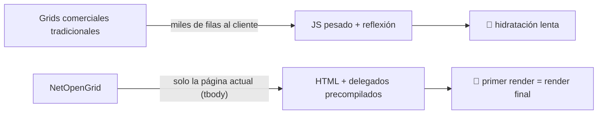
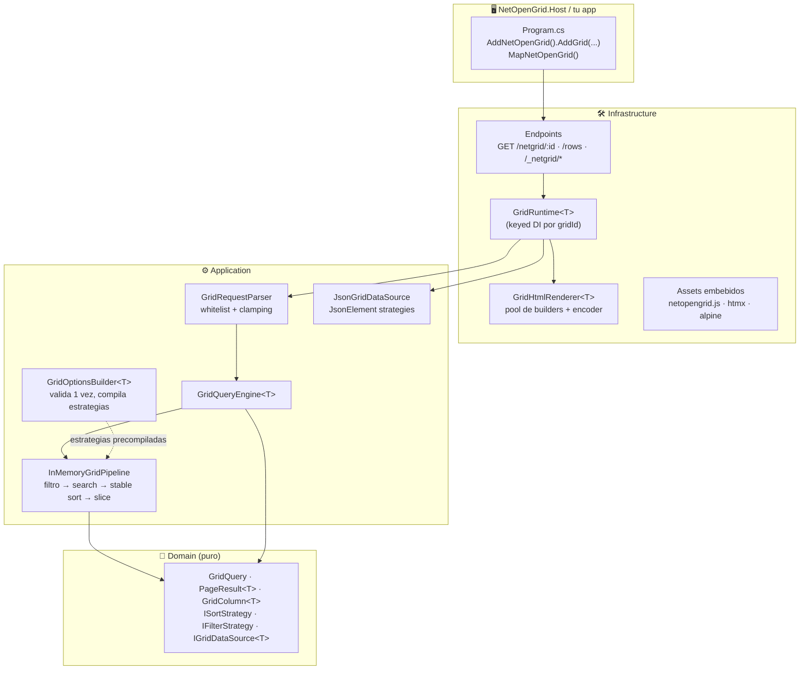
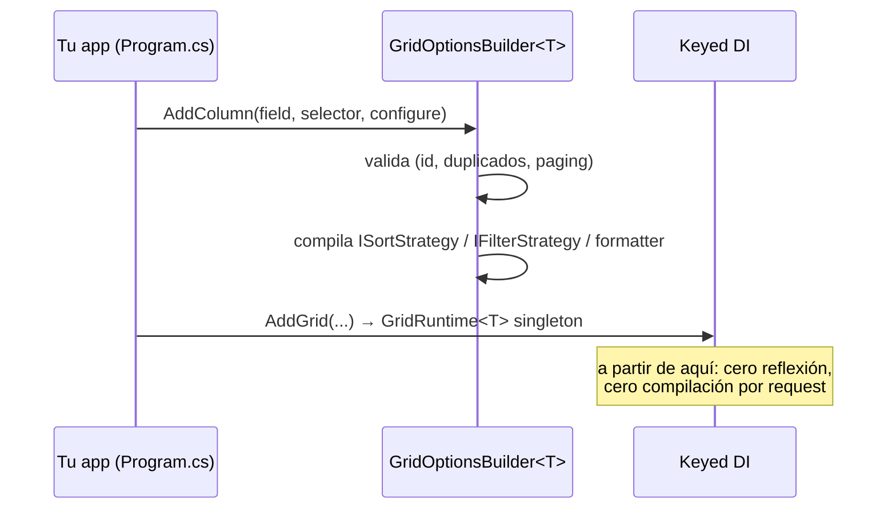
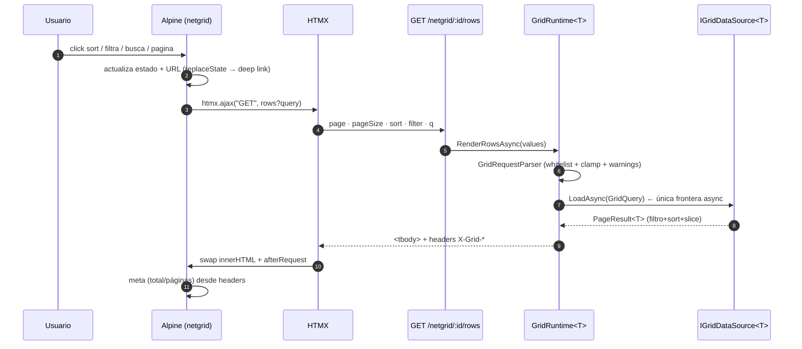
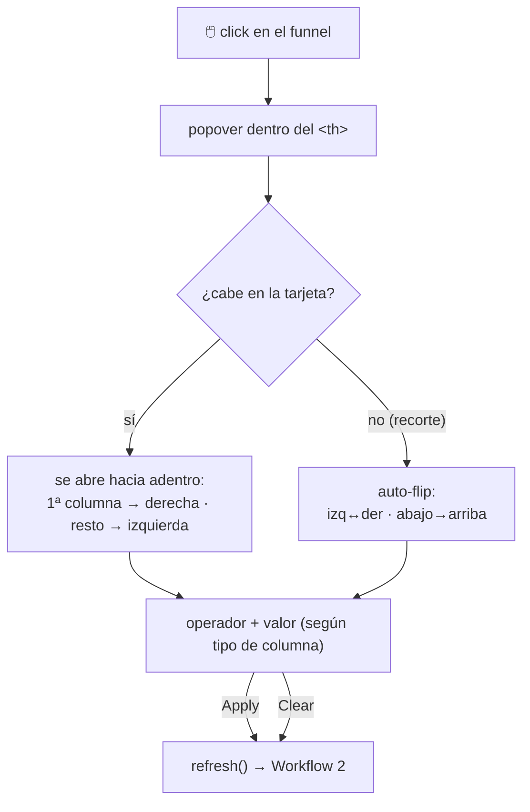
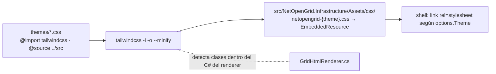
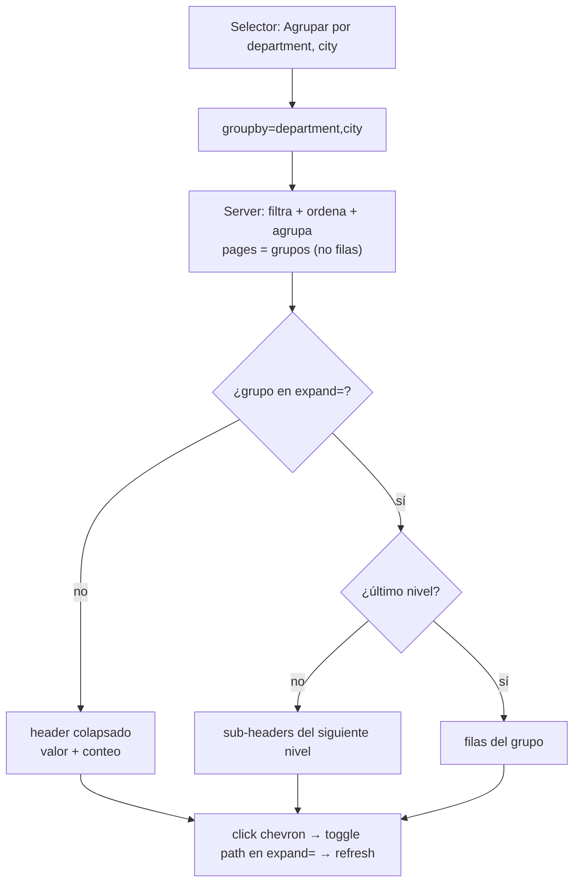

<div align="center">

[](README.md)
[](README.en.md)

# ⚡ NetOpenGrid

**El grid para .NET 10 que apuesta por otra arquitectura: HTML del servidor + delegados precompilados.**

Sin virtual DOM. Sin reflexión en el hot path. Sin compilar expresiones por request.

[](https://dotnet.microsoft.com)
[](https://learn.microsoft.com/dotnet/csharp/)
[](https://tailwindcss.com)
[](https://htmx.org)
[](https://alpinejs.dev)
[](#-testing)
[](LICENSE)

</div>

---

## 📖 Tabla de contenidos

- [Por qué existe](#-por-qué-existe)
- [✨ Features](#-features)
- [Stack](#-stack)
- [Arquitectura](#-arquitectura)
- [Instalación](#-instalación)
- [Quickstart](#-quickstart)
- [Workflows](#-workflows)
- [EF Core (push-down a SQL)](#-ef-core-push-down-a-sql)
- [Filtros tipo Excel (conteo por valor)](#-filtros-tipo-excel-conteo-por-valor)
- [Columnas fijadas y reordenables](#-columnas-fijadas-y-reordenables)
- [Export CSV server-side](#-export-csv-server-side)
- [i18n](#-i18n)
- [Agrupamiento por columna (anidado)](#-agrupamiento-por-columna-anidado)
- [Referencia de configuración](#-referencia-de-configuración)
- [Tipos de columna y operadores](#-tipos-de-columna-y-operadores)
- [Contrato cliente ↔ servidor](#-contrato-cliente--servidor)
- [Modo JSON](#-modo-json)
- [Temas (Tailwind v4)](#-temas-tailwind-v4)
- [Rendimiento](#-rendimiento)
- [Estructura del proyecto](#-estructura-del-proyecto)
- [Testing](#-testing)
- [Roadmap](#-roadmap)
- [Licencia](#-licencia)

---

## 🧭 Por qué existe

Las suites de grid comerciales tradicionales muestran miles de filas en el cliente y pagan el precio en
JS masivo y reflexión. **NetOpenGrid invierte el modelo**: el servidor renderiza solo el `<tbody>` de la
página actual y toda la inteligencia (filtro, orden, búsqueda, paginado) se ejecuta sobre
**delegados compilados una sola vez** al configurar el grid.



> **Regla de oro del proyecto:** cero reflexión y cero `Expression.Compile` por request.
> Todo se compila al construir las opciones; el hot path solo invoca delegados.

---

---

## ✨ Features

| Categoría | Feature | Detalle |
|---|---|---|
| 📊 **Datos** | Fuentes plugables | `InMemoryGridDataSource<T>` · `JsonGridDataSource` (`JsonElement`) · `EFCoreGridDataSource<T>` (push-down SQL) |
| | Tipado sin reflexión | Selectores delegado o expresión; estrategias sort/filter/search compiladas 1 vez al arrancar |
| 🔍 **Filtros** | Por operador | 11 operadores con whitelist por tipo de columna (texto/num/fecha/enum/bool) |
| | Estilo Excel | Checklist de valores distintos **con conteos** (contexto Excel: ignora el filtro propio) |
| | Búsqueda global | `q` con debounce, OR sobre columnas `Searchable` |
| ↕️ **Orden** | Multi-sort estable | Shift-click, ties deterministas (array decorado), nulls primero |
| 🗂️ **Agrupamiento** | Anidado hasta 3 niveles | `groupby` + `expand` en URL; headers con chevron y conteo; grupos se paginan |
| 📄 **Paginación** | Server-side | Clamp de `pageSize`, meta por headers, deep-linking total |
| ☑️ **Selección** | Filas + export | Barra flotante, select-all, CSV de selección o del dataset filtrado completo |
| 📌 **Columnas** | Pin + reorder | Sticky con offsets calculados, drag & drop persistido en `localStorage` |
| 🌐 **i18n** | Presets EN/ES | ~39 claves, override por clave, blob `__NETGRID__.locale` para el cliente |
| 🎨 **Temas** | Tailwind v4 | Presets `grid`/`midnight`, dark mode persistido, escaneo de clases en C# |
| 🔌 **Self-contained** | Assets embebidos | JS + HTMX + Alpine dentro del ensamblado, servidos con `?v={sha}` inmutable |
| 🔗 **Deep links** | Estado en URL | `page·pageSize·sort·filter·q·groupby·expand·cols` — comparte la vista exacta |
| ♿ **A11y** | aria-labels localizados | Roles, `aria-expanded`, focus rings, `x-cloak` |

## 🧱 Stack

| Capa | Tecnología | Rol |
|---|---|---|
| 🔩 Runtime | **.NET 10 / C# 14** (`net10.0`) | records, collection expressions, keyed DI, `ValueTask` |
| 🖥️ Server | **ASP.NET Core** Minimal APIs | endpoints de shell + fragmento + assets embebidos |
| ⚡ Reactividad | **HTMX 2** | `htmx.ajax` para intercambiar solo el `<tbody>` |
| 🪶 Estado local | **Alpine.js 3** | paginación, filtros, selección, tema — sin framework |
| 🎨 Estilos | **Tailwind CSS v4** (CLI standalone) | themes compilados al ensamblado, dark mode |
| 🗄️ Base de datos | **EF Core 10** (opcional) | push-down de filtros/orden a SQL |
| ✅ Testing | **xUnit** + `WebApplicationFactory` | unitarias + integración HTTP end-to-end |

---

## 🏛️ Arquitectura

Dependencias fluyen hacia adentro (DDD). El cliente nunca ve el Domain.



---

## 📦 Instalación

NetOpenGrid se distribuye en cuatro paquetes. **Instala solo el primero** — los demás llegan como dependencias transitivas:

| Paquete | Contenido |
|---|---|
| `NetOpenGrid` | Integración con ASP.NET Core: DI, endpoints, renderer. **Este es el que instalas.** |
| `NetOpenGrid.Core` | Motor de consultas, builders y estrategias de filtrado (transitivo) |
| `NetOpenGrid.Abstractions` | Abstracciones, modelo de columnas y de consulta (transitivo) |
| `NetOpenGrid.EntityFrameworkCore` | Origen de datos para EF Core. Opcional, instálalo aparte |

### Desde el feed local

Genera los paquetes y publícalos en `./artifacts`:

```bash
./tools/pack.sh dev.1        # produce 0.1.0-dev.1
```

En el proyecto que consume, crea un `nuget.config`:

```xml
<?xml version="1.0" encoding="utf-8"?>
<configuration>
  <packageSources>
    <add key="nuget.org" value="https://api.nuget.org/v3/index.json" protocolVersion="3" />
    <add key="netopengrid-local" value="D:\NetOpenGrid\artifacts" />
  </packageSources>
</configuration>
```

Esta fuente local se añade junto a tus feeds existentes; no los reemplaza. Si quieres el aislamiento
estricto que se usó para verificar estos paquetes, añade `<clear />` como primera entrada dentro de
`<packageSources>` — pero ten en cuenta que eso descarta **todas** las fuentes heredadas, incluidas
las corporativas o privadas que ya use tu solución.

```bash
dotnet add package NetOpenGrid --version 0.1.0-dev.1
```

> **Sobre el sufijo `-dev.N`:** NuGet cachea los paquetes por id + versión. Si vuelves a empaquetar con el mismo número de versión, el proyecto consumidor seguirá usando la copia cacheada sin avisar. Usa un sufijo distinto en cada iteración.

### Uso mínimo

```csharp
using NetOpenGrid.Application.DataSources;
using NetOpenGrid.Infrastructure;
using NetOpenGrid.Infrastructure.Endpoints;

var builder = WebApplication.CreateBuilder(args);

builder.Services.AddNetOpenGrid()
    .AddGrid<Person>(
        "people",
        options => options
            .WithTitle("People")
            .AddColumn("name", p => p.Name, c => c.Header("Name").Searchable())
            .AddColumn("email", p => p.Email, c => c.Header("Email")),
        (_, options) => new InMemoryGridDataSource<Person>(options, people));

var app = builder.Build();
app.MapNetOpenGrid();
app.Run();
```

No hace falta `wwwroot`, ni `UseStaticFiles()`, ni herramientas de build. El runtime JS, htmx, Alpine y el CSS de los temas van **dentro del paquete** y los sirve `MapNetOpenGrid`.

### CSS propio

Por defecto `CssPath` es `null` y el tema compilado se sirve desde `{AssetPrefix}/css/netopengrid-{tema}.css`. Si prefieres alojar tu propia hoja de estilos, asígnalo:

```csharp
builder.Services.AddNetOpenGrid(o =>
{
    o.AssetPrefix = "/_netgrid";
    o.CssPath = "/css";          // sirve wwwroot/css/netopengrid-{tema}.css desde tu app
    o.CssFilePrefix = "netopengrid-";
});

var app = builder.Build();
app.UseStaticFiles();     // obligatorio en cuanto asignas CssPath: sirve tu wwwroot/css
app.MapNetOpenGrid();
```

`CssFilePrefix` solo aplica cuando `CssPath` está asignado: no puede renombrar un recurso compilado dentro del ensamblado. `UseStaticFiles()` es **obligatorio** en cuanto asignas `CssPath` — sin él, el `<link>` generado apunta a una ruta que nadie sirve y el grid queda sin estilos. No hace falta si te quedas con el tema embebido por defecto.

> **¿De dónde saco una hoja de estilos para empezar?** `MapNetOpenGrid()` mantiene la ruta embebida montada aunque asignes `CssPath` — lo único que cambia es el `<link>` que genera el renderer. Así que el tema compilado sigue siendo accesible en `{AssetPrefix}/css/netopengrid-{tema}.css`, y puedes descargarlo desde una instancia en ejecución como punto de partida para tu propio `wwwroot/css`:
>
> ```bash
> curl http://localhost:5000/_netgrid/css/netopengrid-grid.css -o wwwroot/css/netopengrid-grid.css
> ```

---

## 🚀 Quickstart

> Proyecto funcional de referencia: [`samples/NetOpenGrid.Example`](samples/NetOpenGrid.Example)

**1. Registra el grid** (las opciones se validan y compilan **una vez**, al arrancar):

```csharp
using NetOpenGrid.Infrastructure;

builder.Services.AddNetOpenGrid()           // sin config: JS + htmx + Alpine + tema, todo embebido
.AddGrid<Employee>("employees",
    options => options
        .WithTitle("Employees")
        .WithTheme("grid")
        .WithDefaultPageSize(10)
        .EnableRowSelection(e => e.Id.ToString("D"))
        .AddColumn("fullName", e => e.FullName, c => c.Header("Full name").Searchable())
        .AddColumn("salary", e => e.Salary, c => c
            .Header("Salary")
            .Align(ColumnAlign.End)
            .Format(v => v.ToString("C0", CultureInfo.GetCultureInfo("en-US"))))
        .AddColumn("hiredOn", e => e.HiredOn, c => c.Format(d => d.ToString("yyyy-MM-dd"))),
    (_, opts) => new InMemoryGridDataSource<Employee>(opts, EmployeeData.All));
```

**2. Mapea los endpoints** (shell + fragmento + assets del componente, CSS del tema incluido):

```csharp
app.MapNetOpenGrid();     // GET /netgrid/:id · /rows · /_netgrid/* (incluye /css/netopengrid-{tema}.css)
```

**3. Abre `http://localhost:PORT/netgrid/employees`.** Eso es todo: el componente sirve su propio
JS y CSS (Alpine + HTMX + tema Tailwind embebidos en el ensamblado) — no hace falta `wwwroot` ni
`UseStaticFiles()`. Para alojar tu propio CSS en vez del embebido, ver
[CSS propio](#css-propio) más arriba.

---

## 🔄 Workflows

### Workflow 1 — Arranque (build time, una sola vez)



### Workflow 2 — Interacción del usuario (el hot path)



### Workflow 3 — Popover de filtros (estilo Excel)



### Workflow 4 — Temas (Tailwind v4)



### Workflow 5 — Agrupamiento anidado



---

## 🗄️ EF Core (push-down a SQL)

`EFCoreGridDataSource<T>` compone `Where` / `OrderBy` / `Skip` / `Take` sobre tu `IQueryable<T>`
usando **las mismas columnas, operadores y reglas de parsing** que el grid in-memory.

```csharp
builder.Services.AddDbContext<AppDb>(o => o.UseSqlite(cs));

services.AddNetOpenGrid().AddGrid<Employee>("employees",
    options => options
        .AddColumn(e => e.FullName, c => c.Searchable())   // ← usa overloads de Expression
        .AddColumn(e => e.Salary)
        .AddColumn(e => e.HiredOn),
    (sp, opts) => new EFCoreGridDataSource<Employee>(
        opts,
        sp,
        (sp, db) => db.Set<Employee>().AsNoTracking()));
```

Reglas importantes:

| Regla | Detalle |
|---|---|
| 🧾 **Columnas con Expression** | Para push-down, define las columnas con los overloads `AddColumn(e => e.Prop, …)`. Si una columna ordenable/filtrable solo tiene `Func`, falla al construir con un error que lista los campos. |
| 🔤 **Strings vía `LIKE`** | `contains/starts-with/ends-with/equals` se traducen a `EF.Functions.Like` (insensible a mayúsculas en collations por defecto; wildcards escapados). |
| 🔢 **Valores parseados 1 vez** | El literal del filtro se parsea con el **mismo** parser invariante del pipeline in-memory y se incrusta como constante en el árbol. |
| 🧵 **DbContext con scope** | El data source crea un `IServiceScope` por request — tu `DbContext` registrado como scoped funciona tal cual. |
| ↩️ **Orden estable** | SQL no garantiza estabilidad en empates: agrega un sort por columna única para paginación determinista. |

---

## 📋 Filtros tipo Excel (conteo por valor)

Las columnas de texto, enum y bool muestran un **checklist con valores distintos y conteos** en el popover:

- Los conteos respetan el contexto actual (búsqueda + otros filtros) e **ignoran el propio filtro de la columna** — semántica Excel clásica.
- Búsqueda interna, *Select all* y aviso de truncado (`FilterValuesLimit`, default 200).
- Al aplicar genera un filtro `in`:

```
filter=category:in:["Books","Toys"]
```

- Endpoint de valores (usado por el popover, útil también para tu propio UI):

```
GET /netgrid/:id/values?field=category&<contexto>
→ {"field":"category","totalDistinct":5,"limit":200,"values":[{"value":"Books","count":28},…]}
```

Implementado en los tres motores: in-memory (agrupación en snapshot), JSON (`JsonElement`) y EF Core (`GROUP BY` traducido a SQL). Las columnas numéricas/fecha mantienen el popover de operador.

---

## 📌 Columnas fijadas y reordenables

```csharp
.AddColumn("sku", p => p.Sku, c => c.Header("SKU").Pinned())
```

- **Pinned**: `position: sticky` en `th`/`td` con offsets calculados por JS tras cada render/resize — la columna queda visible al hacer scroll horizontal (la columna de selección siempre se fija).
- **Reordenables**: arrastra el `th` para reordenar. El orden se persiste en `localStorage` por grid y viaja al servidor como `cols=field1,field2,…`; el renderer valida contra la whitelist (campos desconocidos se ignoran, los no mencionados se agregan al final en su orden por defecto).

---

## 📤 Export CSV server-side

`GET /netgrid/:id/export?<contexto>` descarga el **dataset completo** (todas las páginas) con el
filtro, búsqueda, orden y orden de columnas (`cols`) actual — RFC-4180, escaping de comas/comillas/saltos.

```csharp
// sin configuración: MapNetOpenGrid() ya publica la ruta
// GET /netgrid/employees/export?filter=department:equals:Design&sort=id
// → Content-Disposition: attachment; filename=employees.csv
```

- Los valores usan los formatters de columna (`Format`); `RawCellHtml` se ignora por seguridad.
- El toolbar incluye un botón de descarga que exporta con el contexto actual del cliente.
- Paginación transparente: itera páginas de `MaxPageSize` hasta cubrir el total.

---

## 🌐 i18n

Todos los labels del cliente (botones, aria-labels, operadores, contadores, rangos) pasan por
`NetOpenGridLocalizationOptions`: defaults en inglés, preset **español** incluido y override por clave.

```csharp
builder.Services.AddNetOpenGrid(
    o => { o.AssetPrefix = "/_netgrid"; },
    loc => loc.UseCulture("es")                       // preset incluido
              .Set("filter.apply", "Filtrar"));       // override fino
```

- El shell inyecta `__NETGRID__.locale` con el diccionario efectivo: Alpine renderiza chips,
  contadores y rangos con las mismas cadenas (fallbacks EN embebidos en el JS).
- ~39 claves: `search.*`, `pager.*`, `records.*`, `range.*`, `filter.*`, `select.*`, `chips.*`, `ops.*`, `pin.aria`, `theme.aria`, `export.aria`.
- El mensaje de vacío sigue siendo `WithEmptyMessage(...)` (por grid).

---

## 🗂️ Agrupamiento por columna (anidado)

`groupby=field1,field2,…` (hasta 3 niveles) + `expand=` para desplegar grupos. **Los grupos se paginan** (no las filas); expandir un grupo muestra sus sub-grupos o sus filas (estilo DevEx, cada nivel se expande por separado). Estado en la URL → deep-links con grupos abiertos.

```
GET /netgrid/:id/rows?groupby=department,city&expand=department=Design|city=Lima
```

- Toolbar con selector "Agrupar por..." + chips removibles por nivel.
- Headers de grupo con chevron, conteo de filas y indentación por nivel; valores vacíos → bucket "(Vacíos)".
- El orden de los grupos respeta el sort de la columna agrupada; los sorts restantes ordenan dentro de cada grupo.
- Motores: in-memory y JSON agrupan en memoria; **EF Core** hace push-down de filtro+orden a SQL y construye el árbol sobre las filas coincidentes.

---

## 📚 Referencia de configuración

### `GridOptionsBuilder<T>`

| Método | Default | Descripción |
|---|---|---|
| `.WithId(id)` | — | **Requerido.** `^[A-Za-z][A-Za-z0-9_-]{0,63}$` |
| `.WithTitle / .WithSubtitle` | `"Data grid"` | Encabezado del shell |
| `.WithDefaultPageSize(n)` | `25` | Se clampéa a `[1, MaxPageSize]` |
| `.WithMaxPageSize(n)` | `500` | Techo duro del servidor |
| `.WithPageSizeChoices([...])` | `[10,25,50,100]` | Se ordenan y deduplican |
| `.WithDebounce(ms)` | `300` | Búsqueda global |
| `.WithTheme(name)` | `"grid"` | Compila a `netopengrid-{name}.css` |
| `.WithMinHeight(css)` | `"64rem"` | ≈25 filas; evita el colapso al filtrar. `""` lo desactiva |
| `.WithEmptyMessage(msg)` | `"No records found."` | Estado vacío centrado |
| `.EnableRowSelection(keyFn)` | off | Barra flotante + export; `keyFn` debe ser estable y único |
| `.WithNavLinks(...)` | `[]` | Navegación del shell |

### `GridColumnBuilder<T, TKey>`

| Método | Default | Descripción |
|---|---|---|
| `.Header(text)` | nombre humanizado | `birthDate` → "Birth date" |
| `.Selector(Func)` / `.Selector(Expression)` | — | La expresión se compila **una vez** aquí (y se conserva para push-down EF) |
| `.Format(Func<TKey,string?>)` | `DefaultValueFormatter` | Invariant culture, sin boxing |
| `.RawCellHtml(Func<T,string?>)` | — | ⚠️ HTML de confianza (badges); lo demás siempre se escapa |
| `.Sortable / .Filterable / .Searchable` | `true/true/auto` | `auto`: búsqueda solo en columnas de texto |
| `.AllowedOps(FilterOpSet)` | `All` | Se **intersecta** con lo soportado por el tipo |
| `.Comparer / .Parser / .SearchMatch` | built-ins | Overrides sin reflexión |
| `.Align / .WidthCss / .Visible` | `Start/–/true` | Presentación |
| `.DataType(...)` | inferido | `Text · Numeric · Date · Boolean · Enum · Unknown` |

### Assets (servidos por el componente, embebidos en el ensamblado)

| Opción | Default | Descripción |
|---|---|---|
| `o.AssetPrefix` | `/_netgrid` | Prefijo para `netopengrid.js` + `vendor/*` + `css/netopengrid-{theme}.css` |
| `o.CssPath` | `null` | Si se asigna, sirve **tu** css de themes desde esa ruta en vez del tema embebido |
| `o.CssFilePrefix` | `netopengrid-` | Nomenclatura de tu css propio; solo aplica si `CssPath` está asignado |

Caché: `Cache-Control: immutable` + `?v={sha256-12}` — cero trabajo de copiado a `wwwroot` con el tema embebido por defecto.

---

## 🎛️ Tipos de columna y operadores

Los operadores ofrecidos en el popover se **intersectan** al construir las opciones:
`lo que pides ∩ preset por tipo ∩ capacidad real de la estrategia`. La UI nunca puede
pedir un operador que el motor no sepa ejecutar.

| Tipo (TKey) | Preset | Operadores |
|---|---|---|
| `string` | Text | `equals` · `not-equals` · `contains` · `starts-with` · `ends-with` · `is-empty` · `is-not-empty` |
| numéricos, `DateOnly`, `DateTime`, `DateTimeOffset` | Numeric | `equals` · `not-equals` · `gt` · `gte` · `lt` · `lte` |
| `enum` | Equality | `equals` · `not-equals` |
| `bool` | Equality | `equals` · `not-equals` |
| otros (clases) | Equality | `equals` · `not-equals` (comparación textual) |

Símbolos compactos aceptados en la query: `=` `!=` `>` `>=` `<` `<=` `~` (contains).

---

## 📡 Contrato cliente ↔ servidor

| Param | Ejemplo | Notas |
|---|---|---|
| `page` | `2` | 1-based |
| `pageSize` | `25` | clamp a `MaxPageSize` |
| `sort` | `salary:desc` (repetible) | shift-click = multi-sort estable |
| `filter` | `city:contains:li` · `amount:>=100` · `status:is-empty` | whitelist por columna |
| `q` | `nico` | búsqueda global (OR sobre columnas `Searchable`) |
| `groupby` | `department,city` | agrupamiento anidado (máx 3 niveles); los grupos se paginan |
| `expand` | `department=Design\|city=Lima` | rutas de grupos desplegados (valores URL-encoded) |
| `cols` | `email,fullName` | orden de columnas (drag & drop; validado, faltantes se agregan al final) |

**Respuesta** (fragmento `<tbody>` + headers):

| Header | Significado |
|---|---|
| `X-Grid-Total` | Total tras filtro (no paginado) |
| `X-Grid-Page` / `X-Grid-Page-Size` | Página servida (normalizada) |
| `X-Grid-Page-Count` | Total de páginas |
| `Cache-Control: no-store` | Siempre fresco |

🔗 **Deep links gratis**: el estado vive en la URL — comparte `?sort=salary:desc&filter=department:equals:design`
y el grid abre exactamente así (el shell server-renderiza esa vista y Alpine la siembra).

---

## 🧊 Modo JSON

Mismo pipeline, filas `JsonElement`. Sin reflexión: los "selectores" son nombres de propiedad.

```csharp
var options = new JsonGridOptionsBuilder()
    .WithId("orders")
    .AddColumn("customer", c => c.Searchable())
    .AddColumn("amount", c => c.AllowedOps(FilterOpSet.Numeric))
    .Build();

services.AddNetOpenGrid().AddGrid(options, (_, o) => new JsonGridDataSource(o, json));
// también: new JsonGridDataSource(o, streamLoader) · JsonGridDataSource.FromFileAsync(...)
```

Propiedades faltantes se comportan como `null` (orden inferior, `is-empty` ✓).

---

## 🎨 Temas (Tailwind v4)

```bash
./tools/build-themes.sh              # compila themes/*.css → Infrastructure/Assets/css
./tools/build-themes.sh --strict     # falla si el CLI de tailwindcss no está en el PATH
```

- La salida se compila **dentro del ensamblado** como `EmbeddedResource` y la sirve
  `MapNetOpenGrid` en `{AssetPrefix}/css/netopengrid-{tema}.css`. Las apps que consumen
  el paquete no necesitan `wwwroot` ni Tailwind. `tools/pack.sh` siempre usa `--strict`,
  así que nunca se publica un paquete sin CSS compilado.
- Los themes usan `@source "../src"`: **Tailwind escanea el C# del renderer** y detecta las clases
  que emite el servidor — por eso no hay CSS muerto ni safelist manual.
- `@custom-variant dark (&:where(.dark, .dark *))` + toggle persistido en `localStorage`
  (script anti-FOUC inline en el shell).
- Crea el tuyo copiando `themes/grid.css` y ajustando `@theme { --color-brand-*: … }`.

---

## 🏎️ Rendimiento

| Decisión | Por qué |
|---|---|
| Delegados precompilados por columna | Cero reflexión/`Compile` en el hot path |
| Tabla de parsers cerrados (`int`, `decimal`, `DateOnly`, `Guid`…) | Sin `MakeGenericType` ni `Activator` |
| Stable multi-sort con array decorado de índices | 1 allocación, ties deterministas, sin cadenas LINQ |
| Renderer con `StringBuilder` pooled + `HtmlEncoder` directo | Cero strings intermedios por celda |
| Fragmento = solo `<tbody>` | El payload mínimo posible por interacción |
| `ValueTask` solo en la frontera de datos | Async donde importa, CPU sync por diseño |
| Assets embebidos con `?v=hash` | 1 request, caché inmutable, sin build steps |
| EF: literales parseados 1 vez e incrustados como constantes | Push-down a SQL con las mismas reglas del pipeline |

---

## 🗂️ Estructura del proyecto

```
NetOpenGrid.slnx
├─ src/
│  ├─ NetOpenGrid.Domain/              💎 modelo puro (queries, columnas, estrategias, contratos)
│  ├─ NetOpenGrid.Application/         ⚙️ builders, parser, pipeline, engine, modo JSON
│  ├─ NetOpenGrid.Infrastructure/      🛠️ runtime keyed-DI, renderer, endpoints, assets embebidos
│  ├─ NetOpenGrid.Persistence.EFCore/  🗄️ EFCoreGridDataSource<T> (push-down a SQL)
│  └─ NetOpenGrid.Host/                🖥️ demo (employees <T> + orders JSON + export CSV)
├─ samples/NetOpenGrid.Example/        📦 ejemplo de consumo mínimo
├─ themes/                             🎨 fuentes Tailwind v4 (grid, midnight)
├─ tests/                              ✅ Domain · Application · EFCore · Integration
├─ tools/                              🔧 build-themes.sh/.cmd · fetch-vendor.sh · check-js.sh
```

---

## ✅ Testing

```bash
dotnet test
```

**102 tests**: Domain (20) · Application (42) · Integration (27) · EFCore (13).

- **Domain**: paginado, operadores (incl. `In`), resultados.
- **Application**: builders (validación, pin, i18n-safe), parser (whitelist/clamps/símbolos/JSON `in`),
  pipeline (filtro+sort+slice, estabilidad, nulls-first), estrategias por tipo, `GridGrouper`
  (anidado/expand/paginación por grupos/blank bucket), modo JSON completo.
- **EFCore**: traducción a SQL sobre SQLite in-memory (filtros por tipo incl. `In`, búsqueda OR, orden,
  paginado, value-counts con `GROUP BY`, agrupamiento) y **paridad de resultados** contra el pipeline in-memory.
- **Integration**: HTTP real sobre `WebApplicationFactory` — sorting, filtros (operador + `in`), búsqueda,
  agrupamiento renderizado, headers de meta, deep-links (shell + `cols`), 404s, export CSV, i18n (shell ES),
  assets embebidos y salud del runtime JS (anti-regresión).

---

## 🗺️ Roadmap

- [x] `EFCoreGridDataSource<T>`: push-down de filtros/sort a SQL reutilizando las mismas estrategias
- [x] Filtros tipo Excel con conteo por valor
- [x] Columnas fijadas (pin) y reordenables
- [x] i18n de labels del cliente
- [x] Agrupamiento por columna (anidado hasta 3 niveles, expand/colapse por URL)
- [x] Export server-side genérico (CSV) como parte del componente

> **✅ Roadmap completado — el componente es feature-complete.**
> Ideas futuras: agregaciones por grupo (SUM/AVG en headers), drag de columnas al panel de grupos,
> export Excel (xlsx), pin derecho, virtualización de filas.

---

## 📄 Licencia

[MIT](LICENSE) — úsalo, modifícalo y distribúyelo libremente; attribution incluida en el archivo.

---

<div align="center">

**NetOpenGrid** — *grids server-first para .NET 10*

`dotnet run --project samples/NetOpenGrid.Example` → `http://localhost:5188/netgrid/products`

[](README.md)
[](README.en.md)

</div>
