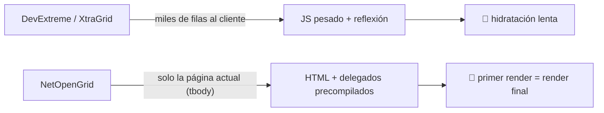
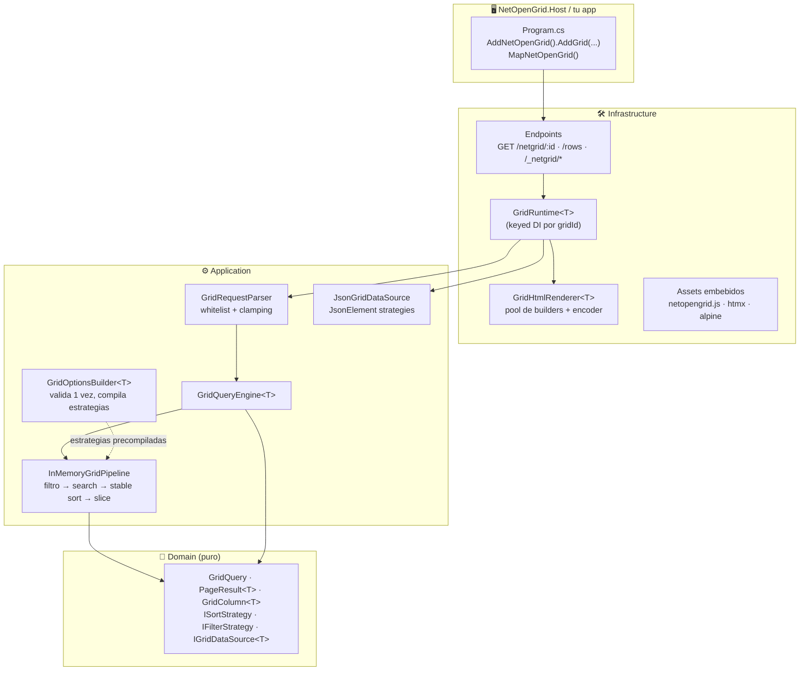
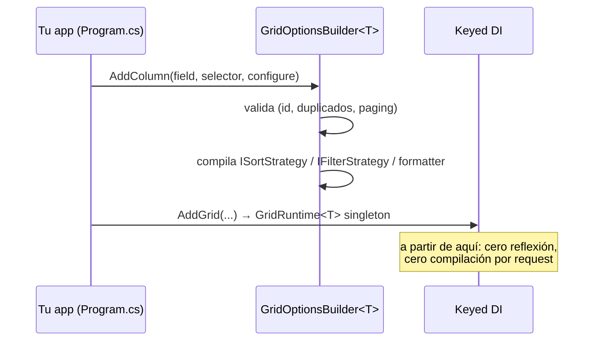
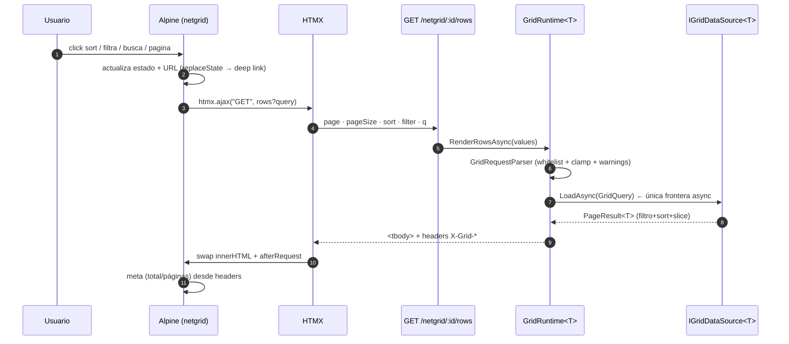
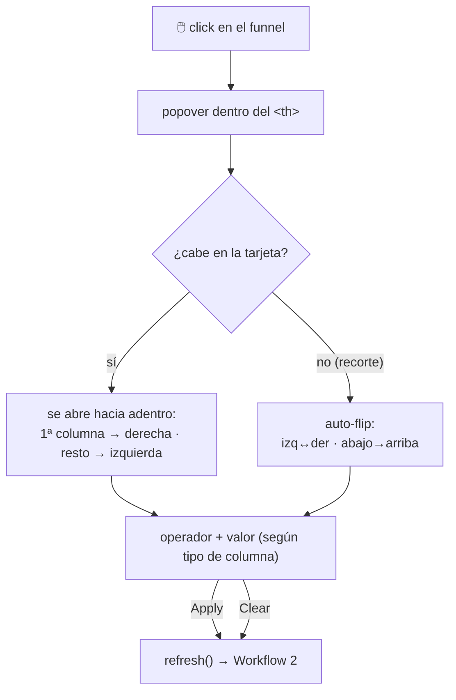
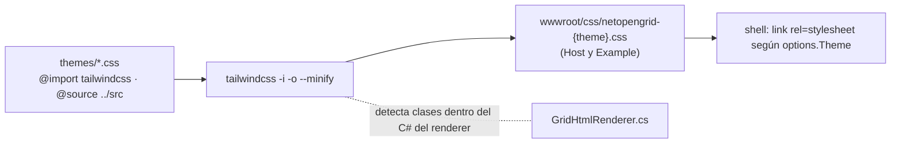

<div align="center">

# ⚡ NetOpenGrid

**El grid para .NET 10 que apuesta por otra arquitectura: HTML del servidor + delegados precompilados.**

Sin virtual DOM. Sin reflexión en el hot path. Sin compilar expresiones por request.

[](https://dotnet.microsoft.com)
[](https://learn.microsoft.com/dotnet/csharp/)
[](https://tailwindcss.com)
[](https://htmx.org)
[](https://alpinejs.dev)
[](#-testing)

</div>

---

## 📖 Tabla de contenidos

- [Por qué existe](#-por-qué-existe)
- [Stack](#-stack)
- [Arquitectura](#-arquitectura)
- [Quickstart](#-quickstart)
- [Workflows](#-workflows)
- [Referencia de configuración](#-referencia-de-configuración)
- [Tipos de columna y operadores](#-tipos-de-columna-y-operadores)
- [Contrato cliente ↔ servidor](#-contrato-cliente--servidor)
- [Modo JSON](#-modo-json)
- [Temas (Tailwind v4)](#-temas-tailwind-v4)
- [Rendimiento](#-rendimiento)
- [Estructura del proyecto](#-estructura-del-proyecto)
- [Testing](#-testing)
- [Roadmap](#-roadmap)

---

## 🧭 Por qué existe

Los grids clásicos (DevExpress, DevExtreme) muestran miles de filas en el cliente y pagan el precio en
JS masivo y reflexión. **NetOpenGrid invierte el modelo**: el servidor renderiza solo el `<tbody>` de la
página actual y toda la inteligencia (filtro, orden, búsqueda, paginado) se ejecuta sobre
**delegados compilados una sola vez** al configurar el grid.



> **Regla de oro del proyecto:** cero reflexión y cero `Expression.Compile` por request.
> Todo se compila al construir las opciones; el hot path solo invoca delegados.

---

## 🧱 Stack

| Capa | Tecnología | Rol |
|---|---|---|
| 🔩 Runtime | **.NET 10 / C# 14** (`net10.0`) | records, collection expressions, keyed DI, `ValueTask` |
| 🖥️ Server | **ASP.NET Core** Minimal APIs | endpoints de shell + fragmento + assets embebidos |
| ⚡ Reactividad | **HTMX 2** | `htmx.ajax` para intercambiar solo el `<tbody>` |
| 🪶 Estado local | **Alpine.js 3** | paginación, filtros, selección, tema — sin framework |
| 🎨 Estilos | **Tailwind CSS v4** (CLI standalone) | themes compilados a `wwwroot/css`, dark mode |
| ✅ Testing | **xUnit** + `WebApplicationFactory` | unitarias + integración HTTP end-to-end |

---

## 🏛️ Arquitectura

Dependencias fluyen hacia adentro (DDD). El cliente nunca ve el Domain.



---

## 🚀 Quickstart

> Proyecto funcional de referencia: [`samples/NetOpenGrid.Example`](samples/NetOpenGrid.Example)

**1. Registra el grid** (las opciones se validan y compilan **una vez**, al arrancar):

```csharp
using NetOpenGrid.Infrastructure;

builder.Services.AddNetOpenGrid(o =>        // opcional: rutas de assets/css
{
    o.AssetPrefix = "/_netgrid";            // js + htmx + alpine servidos por el componente
    o.CssPath = "/css";                     // dónde vive TU css compilado de themes
})
.AddGrid<Employee>("employees",
    options => options
        .WithTitle("Employees")
        .WithTheme("grid")
        .WithDefaultPageSize(10)
        .EnableRowSelection(e => e.Id.ToString("D"))
        .AddColumn("fullName", e => e.FullName, c => c.Header("Full name").Searchable())
        .AddColumn("salary", e => e.Salary, c => c
            .Header("Salary")
            .Align(ColumnAlign.End)
            .Format(v => v.ToString("C0", CultureInfo.GetCultureInfo("en-US"))))
        .AddColumn("hiredOn", e => e.HiredOn, c => c.Format(d => d.ToString("yyyy-MM-dd"))),
    (_, opts) => new InMemoryGridDataSource<Employee>(opts, EmployeeData.All));
```

**2. Mapea los endpoints** (shell + fragmento + assets del componente):

```csharp
app.UseStaticFiles();     // solo para tu css de themes
app.MapNetOpenGrid();     // GET /netgrid/{id} · GET /netgrid/{id}/rows · GET /_netgrid/*
```

**3. Abre `http://localhost:PORT/netgrid/employees`.** Eso es todo: el componente sirve su propio
JS (Alpine + HTMX embebidos en el ensamblado) — no copias nada a `wwwroot`.

---

## 🔄 Workflows

### Workflow 1 — Arranque (build time, una sola vez)



### Workflow 2 — Interacción del usuario (el hot path)



### Workflow 3 — Popover de filtros (estilo Excel)



### Workflow 4 — Temas (Tailwind v4)



---

## 📚 Referencia de configuración

### `GridOptionsBuilder<T>`

| Método | Default | Descripción |
|---|---|---|
| `.WithId(id)` | — | **Requerido.** `^[A-Za-z][A-Za-z0-9_-]{0,63}$` |
| `.WithTitle / .WithSubtitle` | `"Data grid"` | Encabezado del shell |
| `.WithDefaultPageSize(n)` | `25` | Se clampéa a `[1, MaxPageSize]` |
| `.WithMaxPageSize(n)` | `500` | Techo duro del servidor |
| `.WithPageSizeChoices([...])` | `[10,25,50,100]` | Se ordenan y deduplican |
| `.WithDebounce(ms)` | `300` | Búsqueda global |
| `.WithTheme(name)` | `"grid"` | Compila a `netopengrid-{name}.css` |
| `.WithMinHeight(css)` | `"64rem"` | ≈25 filas; evita el colapso al filtrar. `""` lo desactiva |
| `.WithEmptyMessage(msg)` | `"No records found."` | Estado vacío centrado |
| `.EnableRowSelection(keyFn)` | off | Barra flotante + export; `keyFn` debe ser estable y único |
| `.WithNavLinks(...)` | `[]` | Navegación del shell |

### `GridColumnBuilder<T, TKey>`

| Método | Default | Descripción |
|---|---|---|
| `.Header(text)` | nombre humanizado | `birthDate` → "Birth date" |
| `.Selector(Func)` / `.Selector(Expression)` | — | La expresión se compila **una vez** aquí |
| `.Format(Func<TKey,string?>)` | `DefaultValueFormatter` | Invariant culture, sin boxing |
| `.RawCellHtml(Func<T,string?>)` | — | ⚠️ HTML de confianza (badges); lo demás siempre se escapa |
| `.Sortable / .Filterable / .Searchable` | `true/true/auto` | `auto`: búsqueda solo en columnas de texto |
| `.AllowedOps(FilterOpSet)` | `All` | Se **intersecta** con lo soportado por el tipo |
| `.Comparer / .Parser / .SearchMatch` | built-ins | Overrides sin reflexión |
| `.Align / .WidthCss / .Visible` | `Start/–/true` | Presentación |
| `.DataType(...)` | inferido | `Text · Numeric · Date · Boolean · Enum · Unknown` |

### Assets (servidos por el componente, embebidos en el ensamblado)

| Opción | Default | Descripción |
|---|---|---|
| `o.AssetPrefix` | `/_netgrid` | Prefijo para `netopengrid.js` + `vendor/*` |
| `o.CssPath` | `/css` | Dónde sirve **tu** css de themes |
| `o.CssFilePrefix` | `netopengrid-` | Nomenclatura: `netopengrid-{theme}.css` |

Caché: `Cache-Control: immutable` + `?v={sha256-12}` — cero trabajo de copiado a `wwwroot`.

---

## 🎛️ Tipos de columna y operadores

Los operadores ofrecidos en el popover se **intersectan** al construir las opciones:
`lo que pides ∩ preset por tipo ∩ capacidad real de la estrategia`. La UI nunca puede
pedir un operador que el motor no sepa ejecutar.

| Tipo (TKey) | Preset | Operadores |
|---|---|---|
| `string` | Text | `equals` · `not-equals` · `contains` · `starts-with` · `ends-with` · `is-empty` · `is-not-empty` |
| numéricos, `DateOnly`, `DateTime`, `DateTimeOffset` | Numeric | `equals` · `not-equals` · `gt` · `gte` · `lt` · `lte` |
| `enum` | Equality | `equals` · `not-equals` |
| `bool` | Equality | `equals` · `not-equals` |
| otros (clases) | Equality | `equals` · `not-equals` (comparación textual) |

Símbolos compactos aceptados en la query: `=` `!=` `>` `>=` `<` `<=` `~` (contains).

---

## 📡 Contrato cliente ↔ servidor

| Param | Ejemplo | Notas |
|---|---|---|
| `page` | `2` | 1-based |
| `pageSize` | `25` | clamp a `MaxPageSize` |
| `sort` | `salary:desc` (repetible) | shift-click = multi-sort estable |
| `filter` | `city:contains:li` · `amount:>=100` · `status:is-empty` | whitelist por columna |
| `q` | `nico` | búsqueda global (OR sobre columnas `Searchable`) |

**Respuesta** (fragmento `<tbody>` + headers):

| Header | Significado |
|---|---|
| `X-Grid-Total` | Total tras filtro (no paginado) |
| `X-Grid-Page` / `X-Grid-Page-Size` | Página servida (normalizada) |
| `X-Grid-Page-Count` | Total de páginas |
| `Cache-Control: no-store` | Siempre fresco |

🔗 **Deep links gratis**: el estado vive en la URL — comparte `?sort=salary:desc&filter=department:equals:design`
y el grid abre exactamente así (el shell server-renderiza esa vista y Alpine la siembra).

---

## 🧊 Modo JSON

Mismo pipeline, filas `JsonElement`. Sin reflexión: los "selectores" son nombres de propiedad.

```csharp
var options = new JsonGridOptionsBuilder()
    .WithId("orders")
    .AddColumn("customer", c => c.Searchable())
    .AddColumn("amount", c => c.AllowedOps(FilterOpSet.Numeric))
    .AddColumn("status", c => c.RawCellHtml(row =>
        $"<span class=\"badge badge-{row.GetProperty(\"status\")}\">…</span>"))
    .Build();

services.AddNetOpenGrid().AddGrid(options, (_, o) => new JsonGridDataSource(o, json));
// también: new JsonGridDataSource(o, streamLoader) · JsonGridDataSource.FromFileAsync(...)
```

Propiedades faltantes se comportan como `null` (orden inferior, `is-empty` ✓).

---

## 🎨 Temas (Tailwind v4)

```bash
./tools/build-themes.sh     # compila themes/*.css → wwwroot/css (Host y Example)
```

- Los themes usan `@source "../src"`: **Tailwind escanea el C# del renderer** y detecta las clases
  que emite el servidor — por eso no hay CSS muerto ni safelist manual.
- `@custom-variant dark (&:where(.dark, .dark *))` + toggle persistido en `localStorage`
  (script anti-FOUC inline en el shell).
- Crea el tuyo copiando `themes/grid.css` y ajustando `@theme { --color-brand-*: … }`.

---

## 🏎️ Rendimiento

| Decisión | Por qué |
|---|---|
| Delegados precompilados por columna | Cero reflexión/`Compile` en el hot path |
| Tabla de parsers cerrados (`int`, `decimal`, `DateOnly`, `Guid`…) | Sin `MakeGenericType` ni `Activator` |
| Stable multi-sort con array decorado de índices | 1 allocación, ties deterministas, sin cadenas LINQ |
| Renderer con `StringBuilder` pooled + `HtmlEncoder` directo | Cero strings intermedios por celda |
| Fragmento = solo `<tbody>` | El payload mínimo posible por interacción |
| `ValueTask` solo en la frontera de datos | Async donde importa, CPU sync por diseño |
| Assets embebidos con `?v=hash` | 1 request, caché inmutable, sin build steps |

---

## 🗂️ Estructura del proyecto

```
NetOpenGrid.slnx
├─ src/
│  ├─ NetOpenGrid.Domain/           💎 modelo puro (queries, columnas, estrategias, contratos)
│  ├─ NetOpenGrid.Application/      ⚙️ builders, parser, pipeline, engine, modo JSON
│  ├─ NetOpenGrid.Infrastructure/   🛠️ runtime keyed-DI, renderer, endpoints, assets embebidos
│  └─ NetOpenGrid.Host/             🖥️ demo (employees <T> + orders JSON + export CSV)
├─ samples/NetOpenGrid.Example/     📦 ejemplo de consumo mínimo
├─ themes/                          🎨 fuentes Tailwind v4 (grid, midnight)
├─ tests/                           ✅ Domain · Application · Integration (WebApplicationFactory)
└─ tools/                           🔧 build-themes.sh/.cmd · fetch-vendor.sh
```

---

## ✅ Testing

```bash
dotnet test          # 55 tests: Domain (19) · Application (27) · Integration (9)
```

- **Domain**: paginado, operadores, resultados.
- **Application**: builders (validación), parser (whitelist/clamps/símbolos), pipeline (filtro+sort+slice,
  estabilidad, nulls-first), estrategias por tipo (string/num/date/enum/bool), modo JSON completo.
- **Integration**: HTTP real sobre `WebApplicationFactory` — sorting, filtros, búsqueda, headers de meta,
  deep-link en shell, 404s, export CSV y assets embebidos (`/_netgrid/*`, content-type y caché).

---

## 🗺️ Roadmap

- [ ] `EFCoreGridDataSource<T>`: push-down de filtros/sort a SQL reutilizando las mismas estrategias
- [ ] Filtros tipo Excel con conteo por valor
- [ ] Columnas fijadas (pin) y reordenables
- [ ] i18n de labels del cliente
- [ ] Export server-side genérico (CSV/Excel) como parte del componente

---

<div align="center">

**NetOpenGrid** — *server-first grids for .NET 10*

`dotnet run --project samples/NetOpenGrid.Example` → `http://localhost:5188/netgrid/products`

</div>
